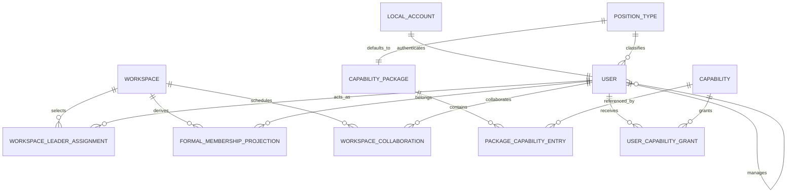

# 组织、Workspace 与 Capability 详细设计

> 文档层级：L2 详细版
> 状态：设计基线（待整体评审）
> 更新日期：2026-08-02
> 对应精简版：[组织、Workspace 与 Capability](./01-organization-workspace-capability.md)
> 适用读者：产品、前端、后端、测试、运维和实施 Agent

## 1. 文档目的

本文定义企业内部 AI 研发平台的组织、Workspace 成员和业务授权模型，是后续数据库设计、API Contract、管理页面、同步任务、鉴权中间件和验收测试的统一依据。

本文中的“必须”“禁止”“只允许”是实现约束。开发人员和 Agent 不得根据常见 RBAC 实现习惯自行增加 Team、手工正式成员或以 Role 为核心的授权路径。

### 1.1 目标

- 以最少的领域概念表达企业组织关系和研发协作边界。
- 由平台维护员工编号、本地密码、Session 和高风险账户 TOTP MFA。
- 让用户账号与 Workspace 解耦，避免在用户创建时维护易失真的团队归属。
- 根据 Workspace Owner、受邀 Leader及其直属员工持续推导正式成员。
- 允许跨组织临时协作，并保证访问在约定时间点立即失效。
- 以“岗位默认 Capability Package + 额外 Grant + Scope”表达用户能做什么、能对哪些资源执行。
- 让菜单、按钮、路由和 API 使用同一套有效权限语义。
- 让每次组织、成员和权限变化可解释、可追溯、可重放。

### 1.2 非目标

- 不建立独立的 Team 实体；Workspace 本身就是营销、财务、人资、制造等团队和数据边界。
- 不在创建用户时选择 Workspace，也不把 Workspace ID 保存为用户主数据字段。
- 不提供手工“设置正式成员”“排除正式成员”或批量导入正式成员功能。
- 不以传统 Role、Role 名称或用户类型作为业务鉴权依据。
- 第一阶段不接入企业 HR 或 SSO，也不建设 HR 式通用组织引擎。
- 不在前端完成最终鉴权；前端控制可见性，后端始终执行独立鉴权。
- 不让 Workspace 平台管理员能力自动转化为 Workspace 业务数据访问能力。
- 不允许普通接口撤销超级管理员的全能力保护。

## 2. 术语与时间语义

| 术语 | 定义 |
| --- | --- |
| 本地账号（Local Account） | 由平台管理员创建、以唯一员工编号登录的认证主体。 |
| 用户（User） | 平台中的人员主体，与本地账号一一对应，并关联一个有效组织身份。 |
| 岗位类型（Position Type） | 包含体系、层级和专业类型，用于约束组织关系并绑定默认 Capability Package，不等同于 Role。 |
| 直属上级（Supervisor） | 用户组织关系中的唯一直接上级；Leader 的上级是同体系经理，普通员工的上级是同体系 Leader。 |
| Workspace | 团队协作和业务资源边界。系统中不存在独立 Team。 |
| Workspace Owner | 创建 Workspace 的 Leader；可以邀请、移除其他 Leader，并转让所有权。 |
| Workspace Leader | Owner 邀请加入的其他 Leader；不能邀请或移除任何 Leader。 |
| Leader 直属员工 | `supervisorUserId` 直接指向该 Leader 的当前有效普通员工，不做递归遍历。 |
| 正式成员 | 由 Owner、受邀 Leader和各 Leader 当前有效直属员工自动组成的成员集合。 |
| 协作成员 | 由具备对应 Capability 的管理员或 Workspace Leader 人工添加、具有强制开始和结束时间的临时成员。 |
| Capability | 一个稳定、可审计的原子业务动作，例如 `requirement:create`、`workspace:member:read`。 |
| Capability Package | Capability 与默认 Scope 模板的集合，由岗位类型提供默认授权。 |
| Grant | 对单个用户额外授予某项 Capability 的记录，必须和 Scope 共同生效。 |
| Scope | Capability 可以作用的资源范围，例如 Platform、Workspace、Project、Requirement 或 Repository。 |
| 有效权限 | 在当前时间、用户状态、Workspace 成员关系、Capability 和 Scope 均满足时形成的可执行权限。 |
| Role | 传统角色概念。可以作为框架兼容或展示标签存在，但不是业务授权事实源。 |

所有时间字段使用 UTC 存储，API 使用带时区的 ISO 8601 格式。有效期统一采用半开区间：

```text
validFrom <= now < validTo
```

因此，当 `now == validTo` 时授权已经失效。页面可以按用户时区展示，但不得改变判定语义。

## 3. 核心决策与不变量

以下规则编号应直接用于实现注释、测试名称、审计原因和评审检查。

| 编号 | 不变量 |
| --- | --- |
| `ORG-001` | 系统不存在 Team 领域实体、Team 成员关系或 Team 级授权；Workspace 是唯一团队边界。 |
| `ORG-002` | 创建用户时只维护必要身份信息、岗位类型、直属上级和状态，不接受 Workspace 字段。 |
| `ORG-003` | 每个有效用户至多有一个直属上级；组织关系禁止形成环。 |
| `ORG-004` | 组织层级固定为经理、Leader、普通员工；产品和开发属于两棵独立组织树。 |
| `ORG-005` | Leader 的上级必须是同体系经理；普通员工的上级必须是同体系 Leader。 |
| `WS-001` | 创建 Workspace 的主体必须是有效 Leader，并自动成为唯一 Owner。 |
| `WS-002` | 只有 Owner 可以邀请、移除其他 Leader或转让所有权；受邀 Leader没有 Leader 名单治理权限。 |
| `WS-003` | Workspace 任意时刻必须恰好有一个 Owner；Owner 停用、离开或退出前必须完成转让。 |
| `WS-004` | 正式成员集合等于“Owner + 受邀 Leaders + 各 Leader 当前有效直属普通员工”的去重并集。 |
| `WS-005` | 经理、未受邀 Leader及其员工不会因为组织关系自动进入 Workspace。 |
| `WS-006` | Leader 移除前必须先转交其团队负责的进行中任务。 |
| `WS-007` | 正式成员只读，任何管理页面和公共 API 都不得提供正式成员新增、删除或排除命令。 |
| `WS-008` | 正式成员随 Leader、直属上级和用户状态变化持续同步，重复事件不得产生重复成员。 |
| `COL-001` | 人工添加成员只能创建协作关系；开始时间和结束时间必填，且结束时间必须晚于开始时间。 |
| `COL-002` | 协作关系在结束时间点由鉴权立即判为无效，不能依赖后台任务是否已经执行。 |
| `COL-003` | 协作关系到期或提前终止后保留原记录和审计，不执行物理删除。 |
| `CAP-001` | Role 不作为业务权限判断依据；业务代码只检查 Capability、Scope 和上下文条件。 |
| `CAP-002` | 普通用户有效授权来源为岗位默认 Package 和额外 Grant；每个授权来源必须保留自己的 Scope。 |
| `CAP-003` | Capability 集合与 Scope 集合禁止分开做笛卡尔积，防止把一个来源的能力应用到另一个来源的范围。 |
| `CAP-004` | 所有 Workspace 业务资源同时要求有效成员关系；仅拥有 Capability 不等于可以访问任意 Workspace 数据。明确标记的平台治理 API 不受此成员条件约束。 |
| `CAP-005` | 菜单、按钮和路由按有效 Capability 呈现，API 使用相同语义重新鉴权，API 是最终安全边界。 |
| `CAP-006` | 超级管理员拥有所有当前及未来 Capability 和全平台 Scope，普通管理 API 不得撤销或删除该保护。 |
| `AUD-001` | “人员变动”菜单是只读事件投影，所有实际修改分别在用户或 Workspace 管理页面完成。 |
| `AUD-002` | 组织、Leader、成员、协作和授权的每次变化必须写入不可由普通业务接口修改的审计记录。 |

## 4. 领域边界与模型

### 4.1 限界上下文

```text
Identity
├── LocalAccount
├── Session
└── TotpBinding
        │
        ▼
Organization
├── User
├── PositionType
└── ReportingLine
        │
        │ 组织快照与变更事件
        ▼
Workspace / Membership
├── Workspace
├── WorkspaceLeaderAssignment
├── WorkspaceFormalMembershipProjection
└── WorkspaceCollaboration
        │
        │ 有效成员上下文
        ▼
Authorization
├── Capability
├── CapabilityPackage
├── UserCapabilityGrant
├── Scope
└── AuthorizationPolicy
        │
        ├── 动态菜单
        └── API 鉴权
```

- `Identity / Organization` 是岗位和直属上下级关系的事实源。
- `Identity` 负责本地认证、首次激活、密码重置、Session 和 TOTP MFA。
- `Organization` 负责岗位和直属上下级关系。
- `Workspace / Membership` 保存 Leader 配置、系统推导结果和协作关系，不反向修改组织树。
- `Authorization` 消费用户状态、有效成员关系和授权来源，输出可解释的授权结论。
- `Audit` 消费全部领域事件，形成只读人员变动和安全审计视图。

### 4.2 核心关系



图中刻意不存在 Team 和 UserRole。

### 4.3 领域实体

#### LocalAccount

| 字段 | 说明 |
| --- | --- |
| `id` | 稳定账号 ID。 |
| `employeeNo` | 唯一登录标识。 |
| `passwordHash` | 正式密码的单向哈希。 |
| `status` | `PENDING_ACTIVATION`、`ACTIVE`、`SUSPENDED`、`INACTIVE`。 |
| `mustChangePassword` | 首次激活或重置后为 `true`。 |
| `credentialVersion` | 密码重置、停用和 Session 撤销时提升。 |
| `mfaRequired`、`mfaEnrolled` | 高风险账户 TOTP MFA 状态。 |

临时凭据单账号、单次有效且 24 小时过期。正式密码为 15–32 个字符，不强制字符组合，但必须通过弱密码、泄露密码和员工编号等上下文检查。

#### User

| 字段 | 说明 |
| --- | --- |
| `id` | 稳定用户 ID。 |
| `accountId` | 必填本地账号引用。 |
| `displayName` | 展示名。 |
| `positionTypeId` | 必填岗位类型。 |
| `supervisorUserId` | 直属上级；经理为空，Leader 指向同体系经理，普通员工指向同体系 Leader。 |
| `status` | `ACTIVE`、`SUSPENDED`、`INACTIVE`。 |
| `organizationVersion` | 组织信息乐观锁版本。 |

用户创建命令不得出现 `workspaceId`、`workspaceIds`、`teamId` 或 `roleIds`。

#### PositionType

| 字段 | 说明 |
| --- | --- |
| `id`、`code`、`name` | 岗位稳定标识和展示信息。 |
| `track` | `PRODUCT` 或 `ENGINEERING`。 |
| `level` | `MANAGER`、`LEADER` 或 `MEMBER`。 |
| `specialty` | `PRODUCT`、`FRONTEND`、`BACKEND` 或适用的扩展专业类型。 |
| `defaultCapabilityPackageId` | 默认 Capability Package。 |
| `status` | 是否允许继续分配。 |

岗位类型决定默认授权，不决定 Workspace 归属。

#### Workspace

| 字段 | 说明 |
| --- | --- |
| `id`、`code`、`name` | Workspace 标识。 |
| `status` | `ACTIVE` 或 `ARCHIVED`。 |
| `ownerUserId` | 当前唯一 Workspace Owner。 |
| `organizationHealth` | `HEALTHY` 或 `ORG_DATA_INVALID`。 |
| `leaderConfigVersion` | Leader 配置版本。 |
| `membershipVersion` | 正式成员投影版本，用于缓存失效和幂等。 |

`ownerUserId` 只能通过 Workspace 创建或受控所有权转让命令改变。

#### WorkspaceLeaderAssignment

| 字段 | 说明 |
| --- | --- |
| `workspaceId` | 所属 Workspace。 |
| `leaderUserId` | Leader 用户。 |
| `membershipKind` | `OWNER` 或 `INVITED`。 |
| `track` | 从 Leader 当前组织身份复制的 `PRODUCT` 或 `ENGINEERING` 查询投影。 |
| `invitedBy` | 邀请该 Leader 的 Owner；Owner 记录为空。 |
| `configuredAt`、`configuredBy` | 配置审计信息。 |

每个 Workspace 恰好一个 `OWNER`，可有零到多个 `INVITED`。Assignment 按 `(workspaceId, leaderUserId)` 唯一。只有当前 Owner 可以新增或删除 `INVITED`；转让所有权必须在同一事务内交换两名 Leader 的 `membershipKind` 并更新 `ownerUserId`。

#### WorkspaceFormalMembershipProjection

这是可重建的当前态投影，不是人工维护主数据。

| 字段 | 说明 |
| --- | --- |
| `workspaceId`、`userId` | 唯一成员键。 |
| `sources` | `OWNER`、`INVITED_LEADER`、`LEADER_DIRECT_REPORT:<leaderId>` 的去重集合。 |
| `effective` | 用户和 Workspace 当前是否有效。 |
| `organizationVersion` | 生成该记录的组织快照版本。 |
| `membershipVersion` | 所属 Workspace 的成员投影版本。 |
| `derivedAt` | 最近推导时间。 |

同一用户可能同时具有多个来源，但成员概览只显示一行，并展示全部来源。历史变化由事件和审计保存，不能依赖当前投影恢复。

#### WorkspaceCollaboration

| 字段 | 说明 |
| --- | --- |
| `id` | 协作关系 ID。 |
| `workspaceId`、`userId` | 协作人与目标 Workspace。 |
| `validFrom`、`validTo` | 必填有效期，采用半开区间。 |
| `reason` | 必填协作原因。 |
| `resourceScopes` | 可访问的 Project、Repository 或其他 Workspace 内资源范围。 |
| `temporaryGrants` | 本次协作需要的临时 Capability Grant。 |
| `terminatedAt`、`terminatedBy` | 可选提前终止信息。 |
| `state` | `SCHEDULED`、`ACTIVE`、`EXPIRED` 或 `TERMINATED` 的展示状态。 |

`state` 是便于查询的投影，鉴权不得只依赖该字段。

#### Capability 与授权来源

| 实体 | 说明 |
| --- | --- |
| `Capability` | 原子动作，使用稳定 `code`，停用后不能再产生新的授权。 |
| `CapabilityPackage` | 一组 Package Entry，用于岗位默认授权。 |
| `PackageCapabilityEntry` | `(capabilityCode, scopeTemplate)` 元组，不是单纯的 Capability ID 列表。 |
| `UserCapabilityGrant` | `(userId, capabilityCode, scope, validFrom?, validTo?, status)` 元组。 |
| `WorkspaceOwnerEntitlement` | 由当前 `OWNER` Assignment 动态产生的 Leader 名单治理和所有权转让授权，不写入普通 Grant。 |
| `Scope` | 资源范围值，支持 `PLATFORM`、`WORKSPACE`、`PROJECT`、`REQUIREMENT`、`REPOSITORY` 等层级。 |
| `ProtectedSuperAdminBinding` | 受保护的系统级身份绑定，不使用普通 Grant 表示。 |

普通业务 API 不读取 Role 来生成这些实体。若底层安全框架必须使用 Role，则 Role 只能由有效 Capability 投影生成，并且不能成为反向事实源。

## 5. 用户与组织规则

### 5.1 创建账号和用户

账号和用户由平台管理员在同一用例中创建，命令至少包含：

- 唯一员工编号和展示名；
- 岗位类型；
- 按岗位层级要求提供的直属上级；
- 初始状态。

创建页面和 API 不显示、不接受 Workspace。系统签发单账号、单次有效、24 小时过期的临时凭据；首次登录只允许修改密码。正式密码长度为 15–32 个字符，并执行弱密码、泄露密码和员工编号等上下文信息检查。

临时凭据不使用固定默认值，也不保存可回读明文。用户使用临时凭据登录后只能获得受限激活 Session；新密码设置成功后，临时凭据立即失效，账号转为 `ACTIVE`，并签发新的正式 Session。临时凭据过期、已经使用或被重新签发后均不得再次登录。

密码策略要求：

- 长度为 15–32 个字符；
- 不强制大小写、数字或特殊字符组合；
- 拒绝常见弱密码、已知泄露密码以及包含员工编号等账号上下文的密码；
- 允许粘贴和密码管理器；
- 不做无风险依据的周期性强制修改。

超级管理员和持有高风险管理 Capability 的用户必须完成 TOTP MFA 绑定后才能获得完整 Session。管理员重置密码、重置 MFA 或停用账号前必须按线下流程核验身份；密码重置和停用都要提升 `credentialVersion` 并撤销全部现有 Session。

组织约束：

- `MANAGER` 的直属上级为空；
- `LEADER` 必须选择同体系 `MANAGER`；
- `MEMBER` 必须选择同体系 `LEADER`；
- 产品普通员工的专业类型为 `PRODUCT`；
- 开发普通员工的专业类型可以是 `FRONTEND` 或 `BACKEND`；
- 一名用户第一阶段只能有一个有效组织身份。

### 5.2 修改岗位

岗位变化必须与新的组织层级一起校验，不能留下“岗位为普通员工、上级却是经理”等非法组合。通过后重新计算默认 Capability Package：

```text
校验 track / level / specialty 与直属上级
→ 旧岗位 Package 授权失效
→ 新岗位 Package 授权生效
→ 保留仍有效的显式额外 Grant
→ 提升 authorizationVersion
→ 失效菜单和鉴权缓存
```

额外 Grant 不因岗位变化被静默删除，但必须在人员变动视图中标记为“岗位变化后仍保留”，便于管理员复核。

### 5.3 修改直属上级

修改前必须校验：

- 新上级存在且为 `ACTIVE`；
- 新上级不是用户本人；
- Leader 的新上级是同体系经理；
- 普通员工的新上级是同体系 Leader；
- 沿新上级向上遍历不会再次遇到当前用户；
- 请求携带的 `organizationVersion` 未过期。

普通员工更换 Leader 后，系统找出旧 Leader和新 Leader关联的 Workspace，立即提升相关成员与授权版本，再异步重建正式成员投影。Leader 更换经理不会改变其 Workspace 归属，但仍需写入组织与审计事件。

### 5.4 用户状态

- `ACTIVE` 用户可以参与成员推导和授权。
- `SUSPENDED`、`INACTIVE` 用户的登录和 API 访问立即拒绝。
- 密码重置或用户停用必须提升 `credentialVersion`，撤销全部 Session。
- 停用 Workspace Owner 前必须先转让所有权；无法操作时由超级管理员强制转让。
- 用户停用会触发成员同步、授权版本提升、缓存失效和外部临时凭据回收。
- 为保留历史，停用用户不会从审计、Requirement、代码或协作记录中物理删除。

## 6. Workspace 与正式成员规则

### 6.1 创建 Workspace

创建 Workspace 时，服务端按同一组织快照执行：

1. 校验创建者是 `ACTIVE` 的产品或开发 Leader。
2. 创建 Workspace 并把创建者写为唯一 Owner。
3. 创建 `(workspaceId, creatorUserId, OWNER)` Leader Assignment。
4. 计算 Owner 及其当前直属普通员工的正式成员期望集合。
5. 在同一事务中保存 Workspace、Leader Assignment、正式成员投影和 Outbox。

Workspace 创建不要求产品和开发 Leader 同时到位，也不推导共同经理。

### 6.2 邀请、移除与转让

- 只有当前 Owner 可以邀请其他 `ACTIVE` Leader。
- 受邀 Leader不能邀请或移除任何 Leader。
- 邀请不要求 Leader 属于同一经理，也不要求属于同一产品或开发体系。
- Leader 加入后，其当前直属普通员工自动进入正式成员集合。
- 移除受邀 Leader 前，必须先转交其团队负责的进行中任务。
- Owner 不能直接退出或被移除，只能把所有权转让给已有受邀 Leader。
- 超级管理员只在 Owner 无法操作时执行受审计的强制转让。
- 转让不改变其他 Leader和员工的正式成员资格，只改变 Leader Assignment 类型和治理权限。

### 6.3 正式成员算法

设：

```text
L(W) = Workspace W 当前的 Owner 与全部受邀 Leader
R(l) = supervisorUserId 直接等于 Leader l 且 level=MEMBER 的全部 ACTIVE 用户
```

Workspace 的正式成员期望集合为：

```text
FormalMembers(W) =
  L(W)
  ∪ ⋃ R(l), l ∈ L(W)
```

计算要求：

- 集合按 `userId` 去重。
- `R(l)` 只包含一层直属普通员工，不递归遍历。
- 经理、未受邀 Leader及其员工不自动加入。
- 产品和开发 Leader可以同时存在于同一 Workspace，成员集合取并集。
- 第一阶段每名普通员工只有一个 Leader，因此只会有一个 `LEADER_DIRECT_REPORT` 来源。
- `SUSPENDED` 和 `INACTIVE` 用户不属于当前有效正式成员。

### 6.4 正式成员只读

Workspace 详情提供“正式成员概览”，字段至少包括：

- 用户、岗位类型和状态；
- 成员来源；
- 对应 Leader；
- 最近同步时间；
- 当前成员投影版本；
- 异常说明。

该页面不提供选择器、添加、移除、排除、拖拽或批量导入操作。若成员不正确，管理员必须修正用户直属上级，或由 Owner 修正 Workspace Leader 配置。

Owner、受邀 Leader和直属员工都遵守同一规则，不设置“锁定成员”“例外排除”或“手工补正式成员”字段。

### 6.5 Workspace 归档

归档后：

- 所有普通用户对该 Workspace 资源的授权立即失效；
- 停止为其新增正式成员；
- 保留 Leader 配置、成员投影、协作记录和审计；
- 不允许新增或延长协作关系；
- 恢复 Workspace 时必须重新校验 Owner、受邀 Leader及其直属员工，并从当前组织快照全量重建正式成员。

## 7. 正式成员同步机制

### 7.1 触发源

以下变化必须触发受影响 Workspace 的同步：

- Workspace 创建、恢复、Owner 转让或 Leader 配置变化；
- 用户创建；
- 用户直属上级变化；
- 用户状态变化；
- 组织异常修复；
- 定期全量对账。

岗位变化只触发权限重算，不改变正式成员集合。

### 7.2 同步流程

```text
接收组织或 Workspace 事件
→ 根据事件找出受影响 Workspace
→ 读取一致的组织快照和 Leader 配置版本
→ 校验 Owner 和 Leader 状态
→ 计算 FormalMembers 期望集合
→ 与当前投影做差异比较
→ 事务性写入新增、失效和来源变化
→ 提升 membershipVersion
→ 写入 Outbox 和审计
→ 失效授权、菜单和资源访问缓存
```

同步器必须按 `(workspaceId, organizationVersion, leaderConfigVersion)` 幂等。相同版本重复执行的结果必须一致，不得重复发布成员新增或移除事件。

### 7.3 增量同步与全量对账

- 事件驱动同步负责日常近实时更新。
- 周期性全量对账从当前组织事实重新计算所有活动 Workspace，用于修复事件遗漏、乱序或历史缺陷。
- 对账只修复投影，不修改 Leader 或组织事实。
- 大成员差异可以分批写入，但对外只能暴露完整版本，不能把半完成版本作为有效授权依据。

### 7.4 撤权优先

人员离开 Leader 直属关系、Leader 被移除、用户停用或 Workspace 归档属于安全敏感变化：

1. 先提升相关用户和 Workspace 的授权版本。
2. 将旧成员投影标记为不可用于新请求，或在请求时回源当前版本。
3. 清理菜单、API Policy、Sandbox、短期仓库凭据等缓存。
4. 再异步完成大规模成员投影差异写入。

投影处于 `STALE` 或版本无法确认时，受保护写操作默认拒绝，不能为了可用性继续沿用可能过期的成员关系。

### 7.5 同步可观测性

每次同步记录：

- 同步 ID、触发事件和 Correlation ID；
- Workspace、组织版本和 Leader 配置版本；
- 新增、移除、保留和来源变化数量；
- 开始、结束时间和执行状态；
- 错误代码、重试次数和最终处置。

Workspace 成员概览必须展示最近成功同步时间和健康状态。

## 8. 协作成员与到期机制

### 8.1 创建协作关系

协作成员必须是已有用户。创建命令必须提供：

- `userId`；
- `validFrom`；
- `validTo`；
- 协作原因；
- Workspace 内资源 Scope；
- 本次协作所需的临时 Capability。

服务端校验：

- 用户和 Workspace 存在且可用；
- `validTo > validFrom`；
- Scope 全部位于目标 Workspace 内；
- 临时 Capability 是可授予项；
- 操作者是具备 `workspace:collaborator:manage` 的管理员，或是目标 Workspace 当前选定的 Leader；

对相同用户的多个协作区间可以保留，但每条记录必须独立可解释。若区间重叠，鉴权按有效记录的授权元组并集处理，页面必须提示重叠。

Workspace Leader 在自己负责的 Workspace 中默认获得 `workspace:collaborator:manage` 授权元组。无论操作者是管理员还是 Workspace Leader，API 最终都检查该 Capability 和目标 Workspace Scope；Leader 身份不是绕过 Capability 的特殊分支，也不限定只有平台管理员可以添加协作成员。

Owner 与受邀 Leader的 Requirement、协作和研发业务 Capability 按相同规则计算。只有当前 Owner Assignment 额外派生 `workspace:leader:manage` 和 `workspace:ownership:transfer`；这些治理授权随所有权转让立即切换，受邀 Leader不能通过岗位默认 Package 获得。

### 8.2 展示状态

```text
TERMINATED: terminatedAt 非空且 terminatedAt <= now
EXPIRED:    terminatedAt 为空且 now >= validTo
ACTIVE:     terminatedAt 为空且 validFrom <= now < validTo
SCHEDULED:  terminatedAt 为空且 now < validFrom
```

状态按上述顺序匹配，因此提前终止的记录跨过原结束时间后仍显示 `TERMINATED`。状态可以由定时任务持久化，也可以查询时计算。它不是安全判断的唯一输入。

### 8.3 请求时立即失效

鉴权中间件每次必须检查：

```text
validFrom <= now
AND now < validTo
AND (terminatedAt IS NULL OR now < terminatedAt)
```

因此，即使到期任务延迟，`now >= validTo` 的请求也必须被拒绝。权限缓存和访问令牌的有效时间不得超过最近一个相关协作结束时间。

### 8.4 后台到期任务

到期任务负责状态收敛和副作用，不负责定义授权是否有效：

1. 扫描已经跨过 `validTo` 的未收敛记录。
2. 幂等标记为 `EXPIRED`。
3. 提升用户和 Workspace 的授权版本。
4. 回收由该协作关系产生的 Sandbox、临时仓库凭据和其他短期资源访问。
5. 发布到期事件并写入审计。

任务重复执行不能产生重复回收或重复业务事件。

### 8.5 提前终止和修改

- 不提供物理删除。
- 提前终止写入 `terminatedAt`、操作者和原因，并立即失效。
- 缩短有效期后，如果新结束时间不晚于当前时间，按立即到期处理。
- 延长有效期必须重新校验 Scope 和授权人 Capability，并记录前后值。
- 已到期记录不能直接改回有效；需要创建新的协作记录。

### 8.6 与正式成员重叠

如果用户同时是正式成员和有效协作成员：

- 统一成员视图只显示一个用户，并分别展示正式和协作来源。
- 正式成员关系提供 Workspace 成员边界；协作授权仍按自己的 Scope 和时间计算。
- 协作到期不移除仍有效的正式成员身份。
- 正式成员关系消失后，如果协作仍有效，用户继续以协作成员身份访问协作 Scope。

## 9. Capability、Grant 与 Scope

### 9.1 Capability 命名

Capability 使用稳定、与 UI 文案和 URL 解耦的冒号编码：

```text
<resource>:<action>
<resource>:<subresource>:<action>
```

例如：

```text
workspace:read
workspace:leader:manage
workspace:collaborator:manage
requirement:create
requirement:approve
repository:bind
audit:read
```

Capability 改展示名不改编码。被 API Policy、菜单或 Package 引用的 Capability 不能直接删除，只能先停用并完成引用迁移。

### 9.2 岗位默认 Package

岗位类型绑定一个默认 Capability Package。Package 中的每个条目必须同时声明：

- Capability；
- Scope 模板；
- 可选上下文限制。

常规 Workspace 业务 Capability 的默认 Scope 模板为“用户当前有效成员 Workspace”。正式成员的成员 Scope 是整个 Workspace；协作成员的成员 Scope 是协作记录中明确配置的资源范围。

所有正式成员的默认 Package 必须包含当前 Workspace Scope 下的 `requirement:create`。该 Capability 只允许创建 Requirement，不包含确认、验收、代码审批或合并能力。

Package 修改会影响所有绑定该岗位的用户，必须版本化、展示影响人数、写入审计并失效相关授权缓存。

### 9.3 额外 Grant

额外 Grant 用于表达岗位默认能力之外的个体差异。每条 Grant 至少包含：

- 用户；
- Capability；
- 明确 Scope；
- 授权人和授权原因；
- 状态；
- 可选开始和结束时间。

若额外 Grant 配置时间边界，则开始和结束时间必须成对出现，并沿用 `[validFrom, validTo)` 语义。

额外 Grant 不能扩大 Workspace 成员关系定义的最大数据边界，除非该 Capability 明确是平台级管理能力。普通平台管理 Capability 也不能隐式获得 Workspace 业务数据 Scope。

### 9.4 Scope 匹配

资源层级示例：

```text
PLATFORM
└── WORKSPACE
    ├── PROJECT
    │   └── REQUIREMENT
    └── REPOSITORY
```

上级 Scope 可以覆盖其子资源，但必须通过服务端可信资源关系解析。API 不得直接相信客户端提交的 `workspaceId` 和资源归属组合。

对普通用户，最终 Scope 是授权来源 Scope 与有效成员 Scope 的交集：

```text
effectiveScope(entitlement, membership) =
  intersection(entitlement.scope, membership.scope)
```

### 9.5 禁止 Role 旁路

以下写法均禁止作为业务授权：

```text
if user.role == "admin"
if "developer" in user.roles
if route.meta.role == "leader"
```

必须改为检查稳定 Capability，并结合资源 Scope 和成员上下文。Leader、经理、管理员等称谓可以决定初始 Package 或管理流程，但不能在业务接口中替代 Capability。

## 10. 有效权限算法

### 10.1 授权元组

系统不能先分别计算 Capability 集合和 Scope 集合再自由组合。每个授权来源必须保留为独立元组：

```text
Entitlement = (
  capability,
  sourceType,
  sourceId,
  scope,
  validFrom,
  validTo
)
```

普通用户的候选授权元组为：

```text
PositionPackageEntitlements(user.positionType)
∪ ActiveExtraGrantEntitlements(user)
∪ ActiveCollaborationTemporaryEntitlements(user, workspace)
∪ ActiveWorkspaceOwnerEntitlements(user, workspace)
```

`ActiveWorkspaceOwnerEntitlements` 只在用户是目标 Workspace 当前唯一 Owner 时返回 Leader 名单治理和所有权转让元组。即使存在错误配置的普通 Grant，邀请、移除和转让命令仍必须校验当前 Owner 事实，避免绕过 `WS-002`。

### 10.2 授权判定

```text
authorize(user, capability, resource, now):
  1. user.status != ACTIVE
       → DENY(USER_INACTIVE)

  2. resolve resource from trusted server-side data
       → 得到 resourceScope 和 workspaceId

  3. enforce resource state and other non-authorization domain invariants
       → archived Workspace business operation: DENY(WORKSPACE_UNAVAILABLE)
       → organization state is ORG_DATA_INVALID and cannot be trusted:
         DENY(AUTHORIZATION_STATE_STALE)

  4. user has ProtectedSuperAdminBinding
       → ALLOW(SUPER_ADMIN), 并记录高权限审计上下文

  5. capability protects a Workspace business resource
       → resolve active formal/collaboration memberships at now
       → no valid membership: DENY(WORKSPACE_MEMBERSHIP_REQUIRED)
       → set membershipScope to the union of valid membership scopes

     capability protects a platform governance resource
       → set membershipScope to PLATFORM

  6. build entitlement tuples from Package, extra Grants
     and active collaboration temporary Grants

  7. for each entitlement:
       entitlement.capability matches requested capability
       AND entitlement is active at now
       AND intersection(entitlement.scope, membership.scope)
           contains resourceScope
       AND contextual policy passes
       → ALLOW with matched source IDs

  8. no tuple matches
       → DENY(CAPABILITY_OR_SCOPE_MISSING)
```

超级管理员仍必须是有效、已认证用户。账号停用、认证失败、Workspace 归档、资源状态机和人工审批等业务不变量不能被全能力绕过；全能力只消除 Capability 和 Scope 不足。

### 10.3 菜单和 API

- 登录或切换 Workspace 后，后端根据有效授权返回菜单树和 `authorizationVersion`。
- 前端基于返回结果隐藏无权菜单、按钮和路由，避免无效操作。
- 列表类菜单只在用户至少对一个相关 Scope 有查询能力时展示。
- 每个受保护 API 显式声明所需 Capability 和 Scope 解析器。
- API 必须从数据库加载目标资源归属，再执行鉴权。
- 未声明 Policy 的敏感 API 默认拒绝接入生产。
- 客户端传入的 Capability、Role、成员类型或 Scope 结论不可信。

### 10.4 缓存和版本

用户岗位、用户状态、额外 Grant、Workspace 成员、协作有效期或 Policy 变化时，必须提升相关 `authorizationVersion`。

缓存键至少包含用户和授权版本。协作相关缓存 TTL 不得晚于 `validTo` 或 `terminatedAt`。检测到版本不一致时回源重算；无法确认最新版本时，受保护写操作默认拒绝。

### 10.5 超级管理员

超级管理员使用受保护系统绑定表达：

```text
capability = *
scope = PLATFORM
futureCapabilities = included
revocableByNormalApi = false
```

- 不把所有 Capability 逐条复制为普通 Grant。
- 新 Capability 注册后自动包含，无需补授权。
- 普通用户编辑、Grant 撤销、Package 修改和 Role 修改均不能影响该绑定。
- 普通 API 尝试撤销时返回 `SUPER_ADMIN_PROTECTED` 并写入安全审计。
- 删除或停用超级管理员账号属于独立高风险身份流程，至少要保护最后一个可用超级管理员；即使账号被停用，也不能通过普通 Grant API 改变其保护定义。
- 全能力不跳过 Workspace 归档、Requirement 状态机、受保护分支或人工审批等业务规则。

## 11. 页面边界

### 11.1 用户管理

允许：

- 由管理员创建员工编号本地账号；
- 查看首次激活状态并重新签发已过期的临时凭据；
- 触发受审计的密码重置和 Session 撤销；
- 选择岗位体系、层级、专业类型和符合约束的直属上级；
- 为高风险账户查看或重置 TOTP MFA 状态；
- 修改用户状态；
- 查看系统推导出的 Workspace 和有效 Capability。

禁止：

- 在创建或编辑用户时选择 Workspace；
- 直接设置正式成员；
- 通过 Role 下拉框决定业务权限。

### 11.2 Workspace 管理

创建和编辑表单包含：

- Workspace 基本信息；
- 当前唯一 Owner；
- 由 Owner 邀请的其他产品或开发 Leader；
- Owner 可见的邀请、移除和所有权转让操作。

受邀 Leader只查看 Leader 名单，不显示邀请、移除或转让按钮。邀请预览展示目标 Leader、组织体系、直属员工数量和预计成员变化，不检查共同经理。

详情页包含：

- Owner 与受邀 Leader；
- 只读正式成员概览；
- 协作成员列表及管理操作；
- 最近同步状态和成员变更历史。

页面不存在“设置正式成员”入口。

### 11.3 协作成员管理

允许以下主体管理协作成员：

- 具备目标 Workspace Scope 下 `workspace:collaborator:manage` 的管理员；
- 目标 Workspace 当前选定的 Leader，其 Leader 默认授权包含该 Capability；
- 上述主体均可新增协作成员、修改未到期有效区间和 Scope、延长有效期或提前终止。

页面必须明确展示开始时间、结束时间、剩余时间、Scope、临时 Capability、原因和当前状态。到期及终止记录仍可查询。

### 11.4 人员变动

“人员变动”菜单只读，支持按用户、Workspace、变更类型、时间、操作者和同步状态筛选。它不提供编辑、撤销、重放或补录按钮。

实际修改入口：

- 岗位、直属上级、状态：用户管理；
- Leader：Workspace 管理；
- 协作关系：Workspace 协作成员管理；
- Package 和额外 Grant：Capability 管理。

运维重放事件属于受保护运维接口，不属于人员变动业务页面。

### 11.5 Capability 管理

- 岗位类型页面维护默认 Package 绑定。
- Package 页面维护 Capability 与 Scope 模板。
- 用户详情维护额外 Grant。
- 菜单和 API Policy 页面维护资源与 Capability 的引用。
- 超级管理员保护只读展示，不提供撤销按钮。

## 12. API 边界

路径仅表达领域边界，具体版本前缀由统一 API 规范确定。

### 12.1 命令 API

| 方法与路径 | 用途 | 核心约束 |
| --- | --- | --- |
| `POST /auth/login` | 使用员工编号登录 | 临时凭据只签发受限激活 Session；高风险账户完成密码校验后仍需 TOTP MFA。 |
| `POST /auth/password/change` | 首次激活或主动修改密码 | 正式密码必须满足 15–32 位及弱密码、泄露密码和上下文检查。 |
| `POST /auth/mfa/totp/enrollment` | 绑定 TOTP MFA | 只返回一次 Enrollment Secret，确认验证码后绑定才生效。 |
| `POST /auth/mfa/totp/verify` | 完成 TOTP MFA 挑战 | 验证通过后才签发高风险账户的完整 Session。 |
| `POST /users` | 创建用户 | 请求体不接受 Workspace、Team 或 Role 字段。 |
| `POST /users/{userId}/temporary-credentials:reissue` | 重新签发临时凭据 | 仅管理员；旧临时凭据立即失效，新凭据单次有效 24 小时。 |
| `POST /users/{userId}/password:reset` | 重置密码 | 仅管理员在线下核验身份后执行；撤销全部 Session 并要求再次修改密码。 |
| `POST /users/{userId}/sessions:revoke` | 撤销全部 Session | 仅管理员或安全流程；提升 `credentialVersion` 并写入安全审计。 |
| `POST /users/{userId}/mfa/totp:reset` | 重置 TOTP MFA | 仅管理员在线下核验身份后执行；撤销全部 Session，高风险账户需重新绑定。 |
| `PATCH /users/{userId}/organization` | 修改岗位或直属上级 | 校验组织环和受影响 Workspace。 |
| `PATCH /users/{userId}/status` | 修改用户状态 | 立即提升授权版本并触发同步。 |
| `POST /workspaces` | 创建 Workspace | 创建者必须是有效 Leader，并自动成为唯一 Owner。 |
| `POST /workspaces/{workspaceId}/leaders` | 邀请 Leader | 仅 Owner；目标必须是有效 Leader。 |
| `DELETE /workspaces/{workspaceId}/leaders/{leaderUserId}` | 移除受邀 Leader | 仅 Owner；进行中任务已完成转交。 |
| `POST /workspaces/{workspaceId}/ownership:transfer` | 转让所有权 | 仅 Owner；目标必须是现有受邀 Leader。 |
| `POST /workspaces/{workspaceId}/ownership:force-transfer` | 强制转让所有权 | 仅超级管理员，用于 Owner 无法操作的异常场景。 |
| `POST /workspaces/{workspaceId}/collaborations` | 新增协作成员 | 开始、结束、原因和 Scope 必填；管理员或 Workspace Leader 必须具备目标 Scope 下的 `workspace:collaborator:manage`。 |
| `PATCH /workspaces/{workspaceId}/collaborations/{id}` | 修改有效期或 Scope | 重新鉴权并保留前后值。 |
| `POST /workspaces/{workspaceId}/collaborations/{id}:terminate` | 提前终止 | 立即失效，不物理删除。 |
| `POST /users/{userId}/capability-grants` | 创建额外 Grant | Capability 和 Scope 必须成对提交。 |
| `POST /users/{userId}/capability-grants/{id}:revoke` | 撤销额外 Grant | 不能操作超级管理员保护。 |

所有写命令使用乐观锁或版本字段，并支持统一幂等键。

### 12.2 查询 API

| 方法与路径 | 用途 |
| --- | --- |
| `POST /workspaces/{workspaceId}/leader-invitations:preview` | 校验目标 Leader 并返回直属员工与成员变化预览，不落库。 |
| `GET /workspaces/{workspaceId}` | 返回 Workspace、Owner、受邀 Leader和同步健康状态。 |
| `GET /workspaces/{workspaceId}/members?type=FORMAL` | 查询只读正式成员投影及来源。 |
| `GET /workspaces/{workspaceId}/members?type=COLLABORATION` | 查询协作记录，包括到期和终止记录。 |
| `GET /users/{userId}/derived-workspaces` | 查询用户由组织和协作产生的 Workspace。 |
| `GET /users/{userId}/effective-entitlements` | 查询可解释的授权元组及来源。 |
| `GET /me/authorization-context` | 返回当前用户菜单、Capability 摘要、Scope 和版本。 |
| `GET /personnel-changes` | 查询只读人员变动投影。 |

### 12.3 明确不存在的 API

以下语义不得实现：

```text
POST   /workspaces/{id}/formal-members
PUT    /workspaces/{id}/formal-members
DELETE /workspaces/{id}/formal-members/{userId}
POST   /teams
POST   /users/{id}/roles
PATCH  /workspaces/{id}/manager
PATCH  /workspaces/{id}/primary-leader
POST   /personnel-changes
PATCH  /personnel-changes/{id}
```

若历史兼容路由仍存在，应返回明确的 `405 Method Not Allowed` 或迁移错误，不得在内部转化为正式成员修改。

### 12.4 领域错误

| 错误码 | 含义 |
| --- | --- |
| `EMPLOYEE_NO_DUPLICATED` | 员工编号已经被其他本地账号使用。 |
| `TEMPORARY_CREDENTIAL_EXPIRED` | 临时凭据已超过 24 小时有效期。 |
| `TEMPORARY_CREDENTIAL_USED` | 临时凭据已经使用、被重签或失效。 |
| `PASSWORD_CHANGE_REQUIRED` | 当前受限 Session 只允许完成首次密码修改。 |
| `PASSWORD_POLICY_VIOLATION` | 正式密码不满足长度、弱密码、泄露密码或上下文检查。 |
| `MFA_ENROLLMENT_REQUIRED` | 高风险账户尚未完成 TOTP MFA 绑定。 |
| `MFA_CHALLENGE_REQUIRED` | 当前登录需要完成 TOTP MFA 挑战。 |
| `IDENTITY_VERIFICATION_REQUIRED` | 管理员重置密码或 MFA 前尚未记录线下身份核验。 |
| `WORKSPACE_OWNER_REQUIRED` | 创建者不是有效 Leader，或 Workspace 缺少唯一 Owner。 |
| `LEADER_DUPLICATED` | 同一 Leader 已经存在于 Workspace。 |
| `LEADER_INACTIVE` | 所选 Leader 当前无效。 |
| `OWNER_PERMISSION_REQUIRED` | 受邀 Leader尝试邀请、移除 Leader或转让所有权。 |
| `OWNER_TRANSFER_REQUIRED` | Owner 尝试退出、被停用或被直接移除。 |
| `LEADER_ACTIVE_WORK_REASSIGNMENT_REQUIRED` | 被移除 Leader仍有未完成的负责事项。 |
| `INVALID_ORGANIZATION_LEVEL` | 岗位层级与直属上级层级不匹配。 |
| `ORGANIZATION_TRACK_MISMATCH` | 用户与直属上级不属于同一产品或开发体系。 |
| `ORGANIZATION_CYCLE` | 直属上级变更会形成组织环。 |
| `FORMAL_MEMBERSHIP_READ_ONLY` | 尝试人工修改正式成员。 |
| `INVALID_COLLABORATION_WINDOW` | 协作时间区间无效。 |
| `SCOPE_OUTSIDE_WORKSPACE` | 协作或 Grant Scope 不属于目标 Workspace。 |
| `WORKSPACE_MEMBERSHIP_REQUIRED` | 缺少有效 Workspace 成员关系。 |
| `CAPABILITY_OR_SCOPE_MISSING` | 没有匹配的授权元组。 |
| `SUPER_ADMIN_PROTECTED` | 尝试撤销超级管理员保护。 |
| `AUTHORIZATION_STATE_STALE` | 无法确认最新授权版本，安全拒绝。 |

## 13. 事件与一致性

### 13.1 事件清单

| 事件 | 主要消费者 |
| --- | --- |
| `LocalAccountCreated` | 激活流程、审计。 |
| `TemporaryCredentialIssued` | 安全审计、通知。 |
| `PasswordChanged` | Session 撤销、审计。 |
| `TotpEnrollmentChanged` | Session 撤销、安全审计。 |
| `SessionsRevoked` | Session Store、安全审计。 |
| `UserCreated` | 成员同步、授权投影、审计。 |
| `UserPositionTypeChanged` | 授权投影、菜单缓存、人员变动。 |
| `UserSupervisorChanged` | 成员同步、人员变动。 |
| `UserStatusChanged` | 成员同步、授权缓存、凭据回收、审计。 |
| `WorkspaceCreated` | 成员同步、审计。 |
| `WorkspaceLeaderInvited` | 成员同步、授权缓存、人员变动。 |
| `WorkspaceLeaderRemoved` | 成员同步、资源回收、人员变动。 |
| `WorkspaceOwnershipTransferred` | 治理权限、菜单缓存、审计。 |
| `WorkspaceFormalMembershipChanged` | 授权投影、资源回收、人员变动。 |
| `WorkspaceCollaborationScheduled` | 授权投影、审计。 |
| `WorkspaceCollaborationActivated` | 授权投影、通知、审计。 |
| `WorkspaceCollaborationExpired` | 授权投影、资源回收、审计。 |
| `WorkspaceCollaborationTerminated` | 授权投影、资源回收、审计。 |
| `CapabilityPackageChanged` | 用户授权重算、菜单缓存、审计。 |
| `UserCapabilityGrantChanged` | 用户授权重算、菜单缓存、审计。 |
| `AuthorizationPolicyChanged` | Policy 和菜单缓存、审计。 |

`WorkspaceFormalMembershipChanged` 可以按批次携带新增、移除和来源变化摘要；大列表存入受控 Artifact 并在事件中保存引用，避免超大消息。

### 13.2 Owner 异常与任务转交

Owner 停用、离职或无法操作时，平台不得让 Workspace 进入无 Owner 状态：

1. 正常场景由 Owner 选择现有受邀 Leader完成转让。
2. 转让命令在同一事务内更新 `ownerUserId` 和两条 Leader Assignment。
3. Owner 已无法操作时，由超级管理员执行强制转让并填写原因。
4. 没有可接任 Leader 时，先邀请或指定一名有效 Leader，再完成强制转让。
5. 受邀 Leader被移除前，Workflow 模块必须确认其团队负责的进行中任务已转交。
6. 转让和移除完成后提升 Leader 配置、成员及授权版本并写入审计。

不得通过普通用户状态 API 绕过上述规则，也不得自动把经理提升为 Owner。

### 13.3 组织数据异常

遇到组织环、缺失用户、缺失直属上级或组织版本倒退时：

- 标记 Workspace 为 `ORG_DATA_INVALID`；
- 不发布基于不完整快照的新增授权；
- 对无法确认的受保护写操作默认拒绝；
- 保留最后成功版本用于排障，但不能把它误报为最新状态；
- 记录同步失败审计并告警；
- 数据修复后执行全量对账。

### 13.4 事件交付

- 领域状态和 Outbox 在同一数据库事务提交。
- 事件至少一次投递，消费者必须用 `eventId` 幂等。
- 事件包含 `aggregateId`、`aggregateVersion`、`occurredAt`、`actorId`、`correlationId` 和 Schema 版本。
- 旧版本事件到达时不得覆盖新成员或授权投影。
- 事件重放不得重复发送人员通知或重复回收资源。

## 14. 异常与边界情况

### 14.1 Leader 与组织

- Leader 没有同体系有效经理：不能创建 Workspace 或接受邀请。
- 受邀 Leader不是 `ACTIVE`：邀请失败；既有无效 Leader立即失去访问。
- 普通员工的上级不是同体系 Leader：组织命令失败。
- Leader 没有直属员工：Leader 本人仍是正式成员。
- Owner 与受邀 Leader可以属于不同经理和不同产品/开发体系。
- 受邀 Leader尝试邀请或移除其他 Leader：返回 `OWNER_PERMISSION_REQUIRED`。
- Owner 未转让所有权就退出或被停用：返回 `OWNER_TRANSFER_REQUIRED`。
- 同一用户属于多个 Workspace：分别计算成员和 Scope，不跨 Workspace 继承数据范围。
- 经理、未受邀 Leader及其员工不会自动进入 Workspace。

### 14.2 成员与协作

- 用户从一个 Workspace Leader直属关系移动到另一个 Workspace Leader：成员不消失，只更新来源。
- 用户离开所有 Workspace Leader直属关系：正式成员立即失效；若协作仍有效，则只保留协作 Scope。
- 移除 Leader 时仍存在由其团队负责的进行中任务：拒绝移除，要求先转交。
- 用户在协作开始前访问：拒绝。
- 用户在协作结束时间点访问：拒绝。
- 到期任务延迟：请求时仍拒绝。
- 协作成员停用：无论时间和 Grant 是否有效均拒绝。
- 协作和正式成员重叠：不重复展示，不因协作到期删除正式成员。
- 已到期协作被要求恢复：拒绝修改，要求创建新记录。
- Workspace 已归档：新增、延长协作失败，现有访问拒绝。

### 14.3 Capability 与 Scope

- 同一 Capability 同时来自 Package 和 Grant：保留两条授权来源，任一有效且 Scope 匹配即可授权。
- Grant Capability 有效但 Scope 不匹配：拒绝。
- Scope 匹配但缺少 Capability：拒绝。
- 前端仍显示缓存菜单而权限已经撤销：API 拒绝并触发前端刷新授权上下文。
- Capability 被停用但仍被引用：既有引用进入配置异常，不产生新授权。
- 用户拥有平台用户管理能力：不能据此读取任意 Workspace Requirement。
- Role 被修改：不得直接改变业务授权结果。
- 授权投影版本落后：写操作安全拒绝或同步回源重算。

### 14.4 超级管理员

- 新增 Capability：超级管理员自动拥有。
- 普通 API 撤销全能力：拒绝并审计。
- 删除普通 Grant：不影响超级管理员保护。
- 超级管理员账号被停用：认证和用户有效性检查仍拒绝访问，但保护绑定不能通过普通接口删除。
- 只剩一个可用超级管理员：普通身份流程不得删除或停用该最后主体。

## 15. 审计与人员变动投影

### 15.1 审计记录

审计记录至少包含：

- `auditId`；
- 事件类型和 Schema 版本；
- 操作者、被操作用户和 Workspace；
- 请求来源、时间和 Correlation ID；
- 变更前后值或受控差异摘要；
- 组织版本、成员版本和授权版本；
- 变更原因；
- 成功、拒绝或失败结果；
- 错误码；
- 关联同步任务和重试结果。

敏感信息不保存明文，只保存脱敏值、摘要或 Secret 引用。审计存储只允许追加和按保留策略归档，普通业务接口不能更新或删除。

### 15.2 必审计动作

- 用户创建、岗位变化、直属上级变化和状态变化；
- Workspace 创建、归档、恢复、Owner 转让和 Leader 变化；
- 正式成员新增、移除和来源变化；
- 协作创建、生效、修改、到期和提前终止；
- Package、Capability、Scope 和 Policy 变化；
- 额外 Grant 创建、修改、到期和撤销；
- 超级管理员保护操作及被拒绝的撤销尝试；
- 因组织或授权状态过期导致的安全拒绝；
- 同步失败、对账修复和外部资源回收。

### 15.3 人员变动视图

人员变动视图从审计和领域事件构建，按一条 Correlation ID 串联：

```text
直属上级变化
→ 受影响 Workspace
→ 正式成员增减
→ 有效 Capability / Scope 变化
→ 缓存失效与外部资源回收
→ 最终同步结果
```

视图只查询，不提供修改命令。即使底层事件重放，业务变更的原始发生时间和原始操作者也不能被覆盖。

## 16. 验收场景

### 16.1 用户与 Workspace

| 编号 | 场景 | 预期结果 |
| --- | --- | --- |
| `AC-ID-01` | 新账号使用员工编号和有效临时凭据登录。 | 只获得受限激活 Session；完成首次改密前不能访问其他业务 API。 |
| `AC-ID-02` | 临时凭据已使用、被重签或超过 24 小时后再次登录。 | 登录失败并记录安全审计；管理员可以在线下核验身份后重新签发。 |
| `AC-ID-03` | 首次改密提交少于 15 位、超过 32 位、弱密码、泄露密码或包含员工编号的密码。 | 返回 `PASSWORD_POLICY_VIOLATION`；符合策略的密码不因缺少强制字符组合而被拒绝。 |
| `AC-ID-04` | 管理员完成线下身份核验后重置密码。 | 全部 Session 被撤销，新临时凭据单次有效，用户再次进入首次改密流程。 |
| `AC-ID-05` | 超级管理员或高风险 Capability 持有者完成密码校验但未绑定或未验证 TOTP。 | 不签发完整 Session，分别返回 MFA Enrollment 或 Challenge 错误。 |
| `AC-ORG-01` | 创建用户并尝试提交 `workspaceIds`。 | API 拒绝未知或禁止字段；用户创建页面没有 Workspace 选择。 |
| `AC-ORG-02` | 管理员创建普通员工并选择同体系 Leader。 | 账号和组织身份创建成功；签发单次临时凭据，不产生手工成员记录。 |
| `AC-ORG-03` | 创建 Leader 时选择同体系经理。 | 创建成功；选择普通员工或跨体系经理时返回组织约束错误。 |
| `AC-WS-01` | 有效 Leader 创建 Workspace。 | 创建成功；创建者成为唯一 Owner，其直属员工成为正式成员。 |
| `AC-WS-02` | Owner 邀请不同经理或不同体系的其他 Leader。 | 创建成功；受邀 Leader及其直属员工加入正式成员。 |
| `AC-WS-03` | 受邀 Leader尝试邀请或移除其他 Leader。 | 返回 `OWNER_PERMISSION_REQUIRED`，Leader 名单不变。 |
| `AC-WS-04` | Manager 管理多个 Leader，但只有一个被邀请。 | 经理、其他 Leader及其员工均不自动加入。 |
| `AC-WS-05` | Leader 没有直属员工。 | Leader 本人仍是正式成员。 |
| `AC-WS-06` | 打开正式成员概览。 | 可以查看来源和同步状态，不存在新增、删除或排除操作。 |
| `AC-WS-07` | 调用手工新增正式成员语义的 API。 | 返回 `FORMAL_MEMBERSHIP_READ_ONLY` 或 `405`，不产生数据变化。 |
| `AC-WS-08` | Owner 转让给现有受邀 Leader。 | 新 Owner 获得治理权限，原 Owner 变为受邀 Leader，Workspace 始终只有一个 Owner。 |
| `AC-WS-09` | Owner 未转让就停用。 | 返回 `OWNER_TRANSFER_REQUIRED`；超级管理员可执行有原因的强制转让。 |
| `AC-WS-10` | Owner 与受邀 Leader拥有相同业务 Capability，分别尝试管理 Leader 名单。 | 业务操作按相同 Capability 规则执行；只有 Owner 的动态治理授权允许邀请、移除或转让。 |

### 16.2 人员同步

| 编号 | 场景 | 预期结果 |
| --- | --- | --- |
| `AC-SYNC-01` | 将有效普通员工调整为某个 Workspace Leader 的直属员工。 | 同步后自动成为正式成员，并记录组织变更和成员新增。 |
| `AC-SYNC-02` | 将用户移出所有 Workspace Leader直属关系。 | 旧成员授权版本立即失效；同步后移除正式来源。 |
| `AC-SYNC-03` | 用户从一个 Workspace Leader 转到另一个 Workspace Leader。 | 成员保持一条，仅来源更新。 |
| `AC-SYNC-04` | 停用正式成员。 | 下一次 API 请求立即拒绝；审计和历史成员变化保留。 |
| `AC-SYNC-05` | 同一组织事件重复投递。 | 成员集合和事件结果幂等，不产生重复成员。 |
| `AC-SYNC-06` | 删除一条事件后执行全量对账。 | 对账修复成员投影并记录修复差异。 |
| `AC-SYNC-07` | Leader 更换为另一个同体系经理。 | Workspace 成员不因经理变化而改变，组织变更仍被审计。 |

### 16.3 协作成员

| 编号 | 场景 | 预期结果 |
| --- | --- | --- |
| `AC-COL-01` | 创建协作关系但缺少开始或结束时间。 | 返回 `INVALID_COLLABORATION_WINDOW`。 |
| `AC-COL-02` | 当前时间早于 `validFrom`。 | 协作状态为 `SCHEDULED`，API 拒绝访问。 |
| `AC-COL-03` | 当前时间位于有效区间且 Capability、Scope 匹配。 | 允许访问匹配资源。 |
| `AC-COL-04` | 当前时间恰好等于 `validTo`，到期任务尚未运行。 | API 立即拒绝访问。 |
| `AC-COL-05` | 协作到期任务重复执行。 | 只产生一次有效状态变化和一次资源回收效果。 |
| `AC-COL-06` | 协作成员同时是正式成员。 | 协作到期后正式成员访问不受影响；协作专属 Grant 失效。 |
| `AC-COL-07` | 提前终止协作。 | 下一次请求立即拒绝协作授权，记录终止原因和操作者。 |
| `AC-COL-08` | 查询已到期协作。 | 记录仍存在，可查看原有效期、Scope、Grant 和审计。 |
| `AC-COL-09` | 目标 Workspace Leader 添加协作成员。 | Leader 通过本 Workspace 的 `workspace:collaborator:manage` 默认授权完成添加，不要求其是平台管理员。 |
| `AC-COL-10` | 非 Leader 管理员拥有目标 Workspace Scope 下的 `workspace:collaborator:manage`。 | 管理员可以添加协作成员；缺少 Capability 或 Scope 时拒绝。 |

### 16.4 Capability 与 Scope

| 编号 | 场景 | 预期结果 |
| --- | --- | --- |
| `AC-CAP-01` | 用户岗位默认 Package 包含目标 Capability，且资源位于有效成员 Scope。 | 菜单显示，API 允许。 |
| `AC-CAP-02` | 用户岗位变化，新 Package 不含原 Capability。 | 原菜单消失，API 拒绝；额外 Grant 不被静默删除。 |
| `AC-CAP-03` | 为用户授予额外 Capability，但 Scope 仅为 Project A。 | Project A 允许，Project B 拒绝。 |
| `AC-CAP-04` | 用户有 Capability，但不是目标 Workspace 的有效成员。 | 返回 `WORKSPACE_MEMBERSHIP_REQUIRED`。 |
| `AC-CAP-05` | 用户 Role 名称改为 `admin`，没有对应 Capability。 | 授权结果不变，API 仍拒绝。 |
| `AC-CAP-06` | 前端缓存仍显示已经撤权的菜单。 | API 拒绝，并通过版本变化促使前端刷新。 |
| `AC-CAP-07` | 新增一个平台 Capability。 | 超级管理员自动拥有；普通用户按 Package 或 Grant 决定。 |
| `AC-CAP-08` | 调用普通 Grant API 撤销超级管理员全能力。 | 返回 `SUPER_ADMIN_PROTECTED`，保护不变并写安全审计。 |
| `AC-CAP-09` | Workspace 中任一正式成员创建 Requirement。 | `requirement:create` 在当前 Workspace Scope 生效；确认、验收和 MR 审批能力不随创建权产生。 |

### 16.5 页面与审计

| 编号 | 场景 | 预期结果 |
| --- | --- | --- |
| `AC-UI-01` | 打开人员变动菜单。 | 仅提供查询、筛选和详情，不提供修改按钮。 |
| `AC-UI-02` | 修改用户直属上级并完成成员同步。 | 人员变动详情可串联组织变化、成员差异、授权版本和同步结果。 |
| `AC-AUD-01` | 协作到期。 | 授权立即失效，原协作和到期审计均可查询。 |
| `AC-AUD-02` | 同步因组织环失败。 | Workspace 显示异常状态，审计包含错误码、版本和重试结果。 |

## 17. 实施约束检查表

开发人员和 Agent 在提交实现前必须逐项确认：

- [ ] 数据模型、路由和 API 中没有新增 Team。
- [ ] 用户创建请求和表单中没有 Workspace 字段。
- [ ] 本地账号使用唯一员工编号，临时凭据单次有效且 24 小时过期。
- [ ] 正式密码长度为 15–32 个字符，并执行弱密码、泄露密码和上下文检查。
- [ ] 首次登录只能改密，密码重置和停用会撤销全部 Session。
- [ ] 超级管理员和高风险管理 Capability 持有者强制使用 TOTP MFA。
- [ ] 组织层级严格为经理、Leader、普通员工，且上级与体系匹配。
- [ ] Workspace 创建者必须是 Leader，并成为唯一 Owner。
- [ ] 只有 Owner 可以邀请、移除 Leader和转让所有权。
- [ ] Owner 与受邀 Leader的业务 Capability 规则一致，Owner 只额外获得 Leader 名单治理和所有权转让能力。
- [ ] 正式成员严格按 Owner、受邀 Leader和各 Leader直属普通员工并集计算。
- [ ] 经理不因组织关系自动进入 Workspace。
- [ ] 正式成员页面和 API 全部只读。
- [ ] 人员变动页面全部只读。
- [ ] 协作开始和结束时间均必填，并在请求时检查结束边界。
- [ ] 到期或终止协作保留记录与审计。
- [ ] 业务鉴权没有使用 Role 名称或 Role ID。
- [ ] Package、额外 Grant 和 Scope 按授权元组计算，没有 Scope 串用。
- [ ] 菜单和 API 引用相同 Capability 语义，API 独立鉴权。
- [ ] 撤权会提升版本并失效缓存。
- [ ] 超级管理员全能力覆盖未来 Capability，普通接口不可撤销。
- [ ] 成员同步和到期任务具备幂等、重试和全量对账能力。
- [ ] 所有验收场景都有单元、集成或端到端测试覆盖。
