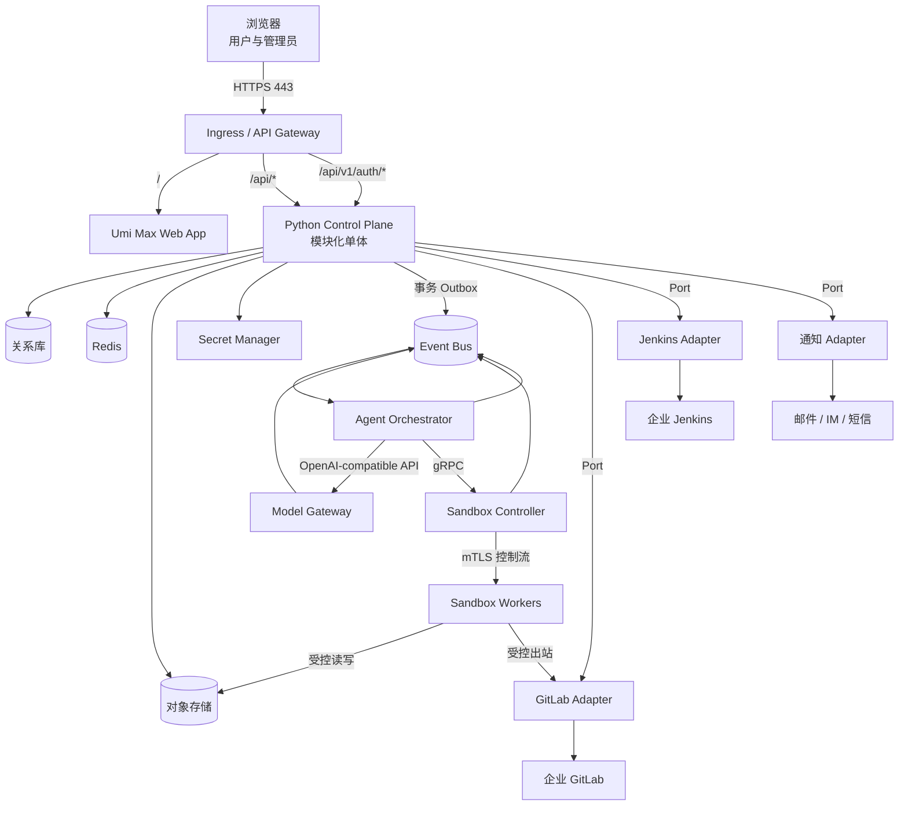
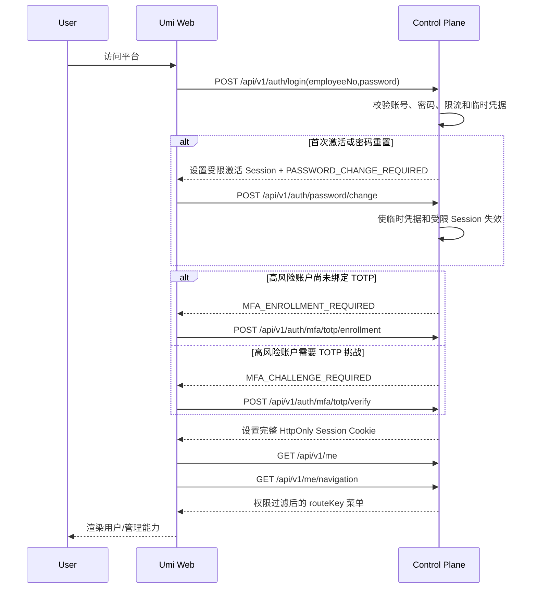
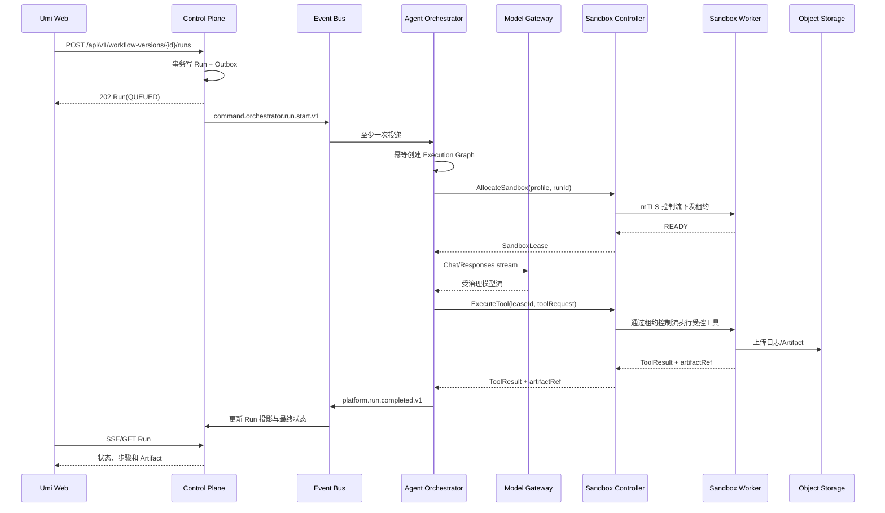
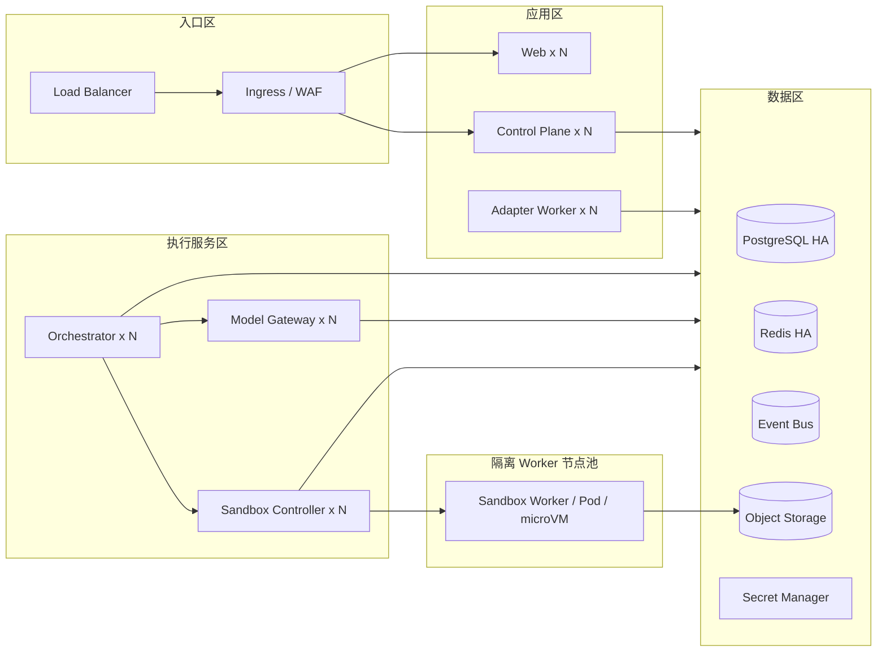

# 内部研发平台技术架构详细设计

> 文档层级：L2 详细版
> 状态：设计基线（待整体评审）
> 更新日期：2026-08-02
> 对应精简版：[平台技术架构](./07-platform-technical-architecture.md)
> 事实基线：以当前仓库的 `package.json`、`config/`、`src/`、`mock/` 和测试配置为准

## 1. 文档目的与阅读约定

本文定义研发工程平台从当前 Umi Max 模板演进到可生产运行平台时必须遵守的技术边界、通信契约和质量要求。它不是当前功能清单，也不是一次性交付计划。

文中使用以下标记：

- **当前态**：仓库中已经存在、可以从代码或配置直接确认的事实。
- **目标态**：后续实现必须收敛到的架构，不代表仓库已经具备。
- **演进态**：从当前态迁移到目标态的阶段性安排。
- **必须**：不可绕过的架构约束；变更必须通过 ADR 评审。
- **应**：默认实现方式；有充分理由时可通过代码评审调整。
- **可以**：允许但不强制的实现方式。

任何开发人员或 Agent 在修改平台前，必须先判断其工作属于当前态修复、目标态新增还是演进兼容，禁止把目标设计描述为已落地能力。

## 2. 范围与非目标

### 2.1 本文覆盖

- 同一个 Umi Max Web App 中的普通用户能力、管理能力、动态菜单和权限呈现。
- Python 模块化单体 Control Plane 的模块边界、数据所有权和 API。
- 独立部署的 Agent Orchestrator、Model Gateway、Sandbox Controller 与 Sandbox Worker。
- GitLab、Jenkins、Model Provider 和通知系统的 Adapter 集成模式。
- 平台本地账号、组织关系和 Workspace 授权边界。
- 关系库、Redis、对象存储、Secret Manager、Outbox 与 Event Bus。
- 网络端口、同步接口、异步事件、部署、安全、可观测性和测试策略。

### 2.2 本文不要求

- 当前阶段不把 Control Plane 拆成按业务域独立部署的微服务。
- 不为用户端和管理端创建两个前端工程或两套构建产物。
- 不允许浏览器、Control Plane 或 Sandbox 绕过 Adapter 直接耦合企业系统私有协议。
- 不把 Redis、Event Bus 或对象存储当作业务关系数据的最终事实源。
- 不因预期规模而提前引入跨地域多活；先保证单地域高可用和可恢复。

## 3. 当前态：仓库事实基线

### 3.1 已有技术栈

| 领域 | 当前事实 | 可复用价值 |
| --- | --- | --- |
| Web 框架 | `@umijs/max ^4.6.64`、React `^19.2.5`、React DOM `^19.2.5`、TypeScript `^6.0.3` | 路由、运行时配置、插件体系和类型检查基础 |
| 构建 | Umi Max，`utoopack: {}` 已启用，包管理器配置为 pnpm | 继续作为唯一 Web 构建链 |
| UI | Ant Design `^6.4.4`、Pro Components `^3.1.12-0`、Icons `^6.2.5`、Ant Design X `^2.9.0` | 表格、表单、布局以及未来 Agent 交互界面基础 |
| 状态与请求 | Umi Model、Initial State、Access、Request、TanStack React Query `^5.101.0` | 可分别承载会话、客户端状态、HTTP 传输和服务端缓存 |
| 样式 | `antd-style ^4.1.0`、Tailwind CSS `^4.3.1`、CSS Modules | 主题 token、布局工具类和局部样式隔离 |
| 质量工具 | Biome `^2.5.0`、TypeScript `--noEmit`、React Doctor | 静态检查和 React 健康检查基础 |
| 测试 | Vitest `^4.1.8`、Vite `^7.3.5`、Testing Library、happy-dom、V8 coverage | 前端单元与组件测试基础；Vite 是测试工具链依赖，不取代 Umi/utoopack 构建 |
| 示例数据 | Umi Request Service、ProTable CRUD、本地 mock | 可用于提炼 API Client 与列表页模式，不是业务实现 |

`@ant-design/x`、`clsx` 和 `dayjs` 已安装，但当前业务代码尚未形成可复用范式；架构实现不得仅根据依赖存在就宣称相关能力已完成。

### 3.2 已启用的 Umi 能力

`config/config.ts` 已启用以下插件或能力：

- `antd`
- `access`
- `model`
- `initialState`
- `request`
- `reactQuery`
- `tailwindcss`
- `layout`
- `utoopack`

当前 `config/routes.ts` 只有 `/home`、`/access`、`/table` 三个静态演示路由。`config/proxy.ts` 的 `dev`、`test`、`pre` 尚未配置真实后端。

### 3.3 当前代码能力边界

- `src/app.ts` 返回固定初始化用户名并配置 Layout；没有真实登录态或用户目录。
- `src/access.ts` 仅根据用户名做演示权限判断；它不是生产 Capability 授权模型。
- `src/models/global.ts` 只有名称状态示例。
- `src/components/QueryDemo` 仅以当前时间演示 React Query 缓存。
- `src/services/demo` 是 OneAPI 风格生成的演示 Client，接口指向 `/api/v1/*`。
- `mock/userAPI.ts` 仅覆盖少量演示接口，不能替代后端契约测试。
- `src/pages/Table` 展示 ProTable/ProForm CRUD 模式，但数据模型仍是示例用户。
- 测试仅有一个 `Guide` 组件测试；尚无页面集成测试、E2E、覆盖率门槛或后端测试。
- 仓库没有 Control Plane、Agent Orchestrator、Model Gateway、Sandbox、数据库迁移、CI/CD 和生产部署配置。
- `husky` 与 `lint-staged` 虽已声明为依赖和脚本，但当前仓库没有对应钩子和 staged 规则文件。

### 3.4 当前态结论

当前仓库是现代化的 Umi Max 前端模板，而不是已经完成的研发工程平台。目标态中的后端、执行面、集成面、持久化、安全和运维能力都必须作为新增系统设计与实现。

## 4. 目标架构原则

1. **一个 Web App**：普通用户和管理员使用同一 Umi Max 应用、同一登录态和同一组件体系，通过服务端动态菜单与权限控制呈现能力。
2. **模块化单体优先**：Control Plane 使用 Python 模块化单体，模块拥有明确的 API、领域模型和表，禁止形成共享数据库式的大泥球。
3. **执行面独立隔离**：Agent Orchestrator、Model Gateway、Sandbox Controller 和 Sandbox Worker 独立部署、独立扩缩容、独立故障域。
4. **控制与执行分离**：Control Plane 保存业务事实与期望状态；执行面负责长任务、模型调用和隔离计算，不在 HTTP 请求生命周期内执行长任务。
5. **集成反腐层**：GitLab、Jenkins、Model Provider 和通知系统全部通过 Adapter 接入；领域模块只依赖稳定 Port。
6. **同步用于查询和受理，异步用于推进**：创建运行等命令同步返回受理结果，实际执行通过 Outbox 与 Event Bus 推进。
7. **数据有唯一所有者**：服务和模块不得直接读取其他服务或模块的私有表。
8. **默认不信任**：浏览器输入、Webhook、代码仓内容、模型输出、Agent 工具结果和 Sandbox 产物都视为不可信数据。
9. **契约先行**：HTTP API、gRPC 接口和事件 Schema 必须版本化并可自动验证。
10. **可观测与可审计内建**：业务状态、执行轨迹、模型用量、集成调用和管理员操作必须可追踪。

## 5. 目标架构总览



### 5.1 平面划分

| 平面 | 组件 | 主要职责 | 不负责 |
| --- | --- | --- | --- |
| 体验面 | Umi Max Web App | 页面、动态菜单、交互、状态呈现 | 权限最终判定、长任务执行 |
| 控制面 | Python Control Plane | 用户目录、Workspace 访问、项目、工作流定义、运行受理、策略、审计和业务事实 | 模型代理、Sandbox 进程管理 |
| 执行面 | Agent Orchestrator、Model Gateway、Sandbox Controller/Worker | 编排、模型调用治理、隔离执行、心跳和执行状态 | 用户目录和企业系统业务协议 |
| 集成面 | GitLab/Jenkins/Model Provider/通知 Adapter | 协议转换、签名校验、限流重试、外部 ID 映射 | 核心领域决策 |
| 数据与事件面 | 关系库、Redis、对象存储、Secret Manager、Outbox/Event Bus | 持久化、缓存、机密、可靠消息 | 绕过领域接口共享数据 |

## 6. Web App 详细设计

### 6.1 单应用承载用户端与管理端

普通用户和管理员必须使用同一个 Umi Max Web App：

- 共享同一域名、登录态、Design Token、Layout 和错误处理。
- 路由组件由前端静态注册；后端动态菜单只能引用受信任的 `routeKey`，不得下发任意组件路径或脚本。
- 管理能力使用 `/admin/*` 路由前缀，但仍属于同一构建产物。
- 菜单响应包含 `audience`、`capabilityCode`、排序和可见性；可见性只改善 UX，后端仍执行授权。
- 无权限路由必须返回 403 页面，未登录返回统一登录流程，未知路由返回 404。

建议的菜单契约：

```json
{
  "data": [
    {
      "id": "project-list",
      "parentId": null,
      "routeKey": "projects.list",
      "path": "/projects",
      "name": "项目",
      "icon": "ProjectOutlined",
      "capabilityCode": "project:read",
      "audience": "both",
      "order": 100,
      "children": []
    }
  ],
  "requestId": "0193f8e2-7c2f-7c7d-a7eb-213cf7396a10"
}
```

前端维护 `routeKey -> React lazy component` 的静态映射。后端下发不存在的 `routeKey` 时，前端记录配置错误并隐藏该菜单，禁止动态执行字符串模块路径。

### 6.2 前端目标目录与依赖方向

目标目录是在当前 `src/` 基础上的增量演进：

```text
src/
  app.ts
  access.ts
  pages/                    # Umi 路由入口，只做页面装配
  features/                 # 按业务能力垂直切分
    auth/
    navigation/
    projects/
    workflows/
    runs/
    agents/
    integrations/
    administration/
  components/               # 跨 feature 的纯 UI 或组合组件
  services/
    generated/              # OpenAPI 自动生成，禁止手改
    transport/              # request 实例、错误映射、拦截器
  models/                   # 少量全局客户端状态
  hooks/                    # 跨业务通用 hook
  types/                    # 通用类型，不放业务实体副本
  utils/                    # 无副作用通用函数
  constants/
```

依赖方向必须是：

```text
pages -> features -> services/generated
pages -> components
features -> components
features -> hooks/utils/constants
services/transport -> @umijs/max request
```

约束如下：

- `pages` 不直接拼装 HTTP 请求，不保存领域规则。
- 一个 `feature` 不得导入另一个 `feature` 的内部文件；跨域复用通过公开 `index.ts` 或上移到共享层。
- `components` 不依赖具体业务 Service。
- `services/generated` 由 OpenAPI 生成；兼容逻辑放在 `services/transport` 或 feature Adapter。
- 当前 `src/services/demo` 在真实 API Client 建立后移除，不扩展为生产 Service。

### 6.3 数据状态约定

| 状态类型 | 唯一推荐载体 | 示例 | 禁止做法 |
| --- | --- | --- | --- |
| URL/导航状态 | Umi Router 的 path、query、params | 筛选条件、当前 Tab、详情 ID | 只存全局 Model 导致刷新丢失 |
| 服务端状态 | React Query | 项目列表、运行详情、权限菜单 | 用 `useEffect + useState` 手写缓存 |
| 会话与全局客户端状态 | Umi Initial State / Model | 当前用户、当前 Workspace、全局 UI 偏好 | 复制完整服务端实体列表 |
| 表单状态 | ProForm / Ant Design Form | 新建工作流、编辑策略 | 同时维护两份表单 state |
| 页面瞬时状态 | React `useState` / `useReducer` | Modal 开关、临时选择 | 上升为全局状态 |
| 实时增量 | SSE 或 WebSocket 事件后更新 React Query Cache | Run 日志、状态变化 | 建立第二套长期实体仓库 |

React Query 约定：

- Query Key 使用 feature 内集中工厂，例如 `runKeys.detail(runId)`，不得散落字符串。
- Query Function 必须调用统一 transport 或生成 Client。
- Mutation 成功后按受影响实体精确失效或更新 Cache，禁止默认清空全部 Query。
- 服务端错误统一映射为 `ApiProblem`；组件不得依赖 Axios/Umi 底层错误结构。
- 列表页优先复用 React Query；ProTable `request` 作为适配层调用同一查询函数，不再建立独立数据语义。
- 实时事件必须携带实体版本；只在版本更新时写入 Cache，避免旧事件覆盖新状态。

### 6.4 权限与菜单启动流程

1. 浏览器访问平台，使用 HttpOnly Session Cookie 调用 `/api/v1/me`。
2. Control Plane 根据本地 Session 返回用户、组织岗位、直属上级、当前 Workspace 和有效 Capability 摘要。
3. Web 调用 `/api/v1/me/navigation` 获取动态菜单。
4. 前端以静态 Route Registry 解析 `routeKey` 并渲染 Layout。
5. `access.ts` 根据 Capability 做组件级展示控制。
6. 每次 API 调用由 Control Plane 重新验证资源范围和权限；前端 `Access` 组件不是安全边界。

## 7. Python Control Plane 模块化单体

### 7.1 技术与内部结构

Control Plane 目标基线采用 Python 3.12、FastAPI、Pydantic 2、SQLAlchemy 2 和 Alembic。具体补丁版本由依赖锁文件固定，升级不得改变本文边界。

每个业务模块遵循相同的四层结构：

```text
backend/control_plane/app/modules/<module>/
  api/               # HTTP DTO、路由、鉴权声明
  application/       # Use Case、命令/查询、事务边界
  domain/            # 实体、值对象、领域服务、领域事件
  ports/             # Repository 与外部系统接口
  adapters/          # SQL Repository、外部 Adapter 实现
```

顶层平台代码：

```text
backend/control_plane/app/
  bootstrap/         # 应用装配、配置和依赖注入
  modules/           # 业务模块
  shared/
    api/             # API 错误、分页、幂等键
    auth/            # 会话解析和授权上下文
    db/              # Unit of Work、基础数据库设施
    events/          # Outbox、Event Envelope
    observability/   # 日志、Trace、Metrics
```

### 7.2 模块边界

| 模块 | 拥有的业务事实 | 对外能力 | 不得承担 |
| --- | --- | --- | --- |
| `identity` | 员工编号账号、密码哈希、临时凭据、Session、TOTP 绑定和服务身份 | 登录、首次激活、密码重置、Session 验证、`/me` Principal | 组织关系、Workspace 授权、执行任务 |
| `organization` | 产品/开发体系、经理/Leader/员工岗位、直属上级和组织版本 | 用户与组织管理、层级校验、组织变更事件 | 登录凭据、Workspace 成员和授权 |
| `workspace` | Workspace、Owner、受邀 Leader、正式成员投影、限时协作、Project 和 Repository Binding | Workspace 治理、成员同步、资源归属解析 | Capability 判定、GitLab 私有协议 |
| `authorization` | Capability、Package、Grant、Scope、有效权限投影和菜单授权 | Capability 判定、动态菜单、授权解释 | 账号认证、组织或 Workspace 主数据 |
| `requirement_workflow` | Requirement、类型路由、状态机、审批 Gate、分支与交付引用 | 创建/推进/取消 Requirement、按类型生成执行意图 | 执行 Agent、模型或 Sandbox |
| `agent_run` | Run、Attempt、Execution Binding、Runtime Bundle 追踪、模型/工具/上下文策略和 Artifact 元数据 | 创建/查询/取消 Run、策略解析、签名 Artifact URL | 具体编排循环、代理模型流量或管理 Worker 进程 |
| `audit` | 安全与管理操作审计索引 | 审计查询、导出 | 充当应用 Debug 日志 |

以上七个目录共同构成一个 Python Control Plane 项目和一个部署单元。GitLab、Jenkins、Model Provider、通知以及对象存储等实现位于各模块的 Adapter 层；它们不是额外的 Control Plane 业务模块。

### 7.3 Identity、Organization、Workspace 与 Capability

目标业务模型只定义 Workspace 这一种团队边界，不另建同义协作实体，也不采用角色授权模型：

- `identity` 由平台管理员创建唯一员工编号账号，负责本地密码、Session、首次激活和高风险账户 TOTP MFA。
- `organization` 固定维护“产品经理 → 产品 Leader → 产品人员”和“开发经理 → 开发 Leader → 前端/后端人员”两棵树。
- `workspace` 把创建者记录为唯一 Owner；只有 Owner 可以邀请、移除其他 Leader或转让所有权。
- Workspace 正式成员为 Owner、受邀 Leader及其当前直属普通员工；不递归遍历，也不自动加入经理。
- 正式成员投影随 Owner、Leader、直属上级和用户状态持续同步。组织关系用于计算 Workspace 成员，但组织树本身不是另一套授权边界。
- 用户具有系统推导的有效正式成员关系或有效限时协作关系后，才能访问相应 Workspace Scope；项目、Workflow、Run、Integration 和 Artifact 都必须归属一个 Workspace。
- 岗位为用户提供默认 `Capability Package`。Package 是可版本化的 Capability 集合，不是身份分组或角色。
- `Grant` 为单个用户追加 Capability，可设置生效时间、过期时间、授予原因和 `Scope`。
- `Scope` 限定 Capability 的作用范围，标准层级为 `workspace:{workspaceId}`、`project:{projectId}` 和 `resource:{resourceType}:{resourceId}`。
- 每个 Package Entry 或额外 Grant 都保留自己的 `(Capability, Scope)` 元组，并与用户有效成员 Scope 求交；禁止先合并全部 Capability 与全部 Scope 再做笛卡尔积。未匹配 Capability、Scope 或成员关系时默认拒绝。
- 所有正式成员默认获得当前 Workspace Scope 下的 `requirement:create`；确认、验收、审批和合并仍需独立 Capability。
- Package 发布、岗位默认绑定、Grant 创建/撤销和 Scope 变化都必须版本化并审计。
- Capability 使用冒号命名，例如 `project:read`、`workflow:run`、`integration:admin`、`workspace:grant`。

`GET /api/v1/me` 由 `identity`、`organization`、`workspace` 和 `authorization` 的 Application Facade 组合，目标响应不包含角色字段：

```json
{
  "data": {
    "user": {
      "id": "user-001",
      "displayName": "示例用户"
    },
    "position": {
      "id": "position-001",
      "name": "高级研发工程师"
    },
    "manager": {
      "userId": "user-002",
      "displayName": "直属上级"
    },
    "activeWorkspace": {
      "id": "workspace-001",
      "name": "研发效能平台"
    },
    "capabilities": [
      {
        "code": "workflow:run",
        "scopes": ["workspace:workspace-001"],
        "source": "POSITION_PACKAGE"
      }
    ]
  },
  "requestId": "0193f8e2-7c2f-7c7d-a7eb-213cf7396a10"
}
```

授权计算顺序固定为：验证 Principal 与 Session、确定当前 Workspace 的正式或协作成员 Scope、加载岗位默认 Package、加载有效 Grant、逐授权来源匹配请求资源 Scope、检查策略约束、输出允许或拒绝。前端只消费最终 Capability，不自行推导 Package 或 Grant。

### 7.4 模块依赖规则

- 模块只能调用另一个模块公开的 Application Facade 或订阅其领域事件。
- 禁止导入其他模块的 Repository、ORM Model 或内部 Domain Entity。
- 每个模块拥有独立数据库 Schema；生产中即使共用关系库实例，也使用不同数据库账号和迁移目录。
- 单次本地业务事务只能修改一个模块拥有的表。
- 跨模块状态推进通过应用服务协调或 Outbox 事件完成，不使用分布式事务。
- 模块 API 不返回 ORM 对象，必须返回显式 DTO。
- 架构测试必须验证模块依赖方向和禁止导入规则。

### 7.5 Control Plane 与执行面的事实所有权

Control Plane 拥有：

- Workflow 定义与版本。
- Run 的业务 ID、提交人、目标、审批、期望状态和最终业务结果。
- Agent、模型与 Sandbox 策略版本。
- 项目、权限、集成连接引用和 Artifact 元数据。

执行面拥有：

- Orchestrator 的活动执行图、步骤尝试、Checkpoint 和调度租约。
- Model Gateway 的请求计量、路由决策和供应商调用状态。
- Sandbox Controller 的运行时租约、Worker 心跳和实例生命周期。
- Sandbox Worker 的短生命周期本地执行状态。

执行面通过事件把状态变化回传给 Control Plane。Control Plane 不查询执行服务私有数据库来拼装页面。

## 8. 独立执行组件

### 8.1 Agent Orchestrator

职责：

- 消费 Run 启动、取消和恢复命令。
- 将 Workflow 版本编译为不可变执行图。
- 为每个步骤创建 Agent Task 和 `AgentRunAttempt`。
- 根据 Requirement 类型加载 Superpowers 路由，并固定 Runtime 镜像 digest、Skill Bundle hash 和实际 Skill 名称。
- 管理重试、超时、取消、人工审批等待和 Checkpoint。
- 调用 Model Gateway，不直接调用模型供应商。
- 通过 Sandbox Controller 申请环境，不直接选择 Worker。
- 产生细粒度执行事件并关联 `runId`、`taskId`、`attemptId`。

关键约束：

- 同一 `runId` 同时只有一个有效执行租约。
- 每个 Task Attempt 使用稳定幂等键，重复消息不得重复产生外部副作用。
- 同一 Attempt 内禁止热更新 Runtime Bundle、Skill、Model 或 Policy；任何变化都创建新 Attempt。
- 重试必须区分可重试基础设施错误、限流、模型错误、工具错误和业务拒绝。
- Checkpoint 必须引用对象存储中的不可变内容及其 SHA-256。
- 取消是协作式状态推进：先进入 `CANCEL_REQUESTED`，再终止模型流和 Sandbox，最终进入 `CANCELLED`。

Run 状态机：

```text
PENDING -> QUEUED -> RUNNING -> SUCCEEDED
                         |----> FAILED
                         |----> TIMED_OUT
                         |----> CANCEL_REQUESTED -> CANCELLED
QUEUED -----------------------> CANCELLED
```

### 8.2 Model Gateway

职责：

- 提供内部 OpenAI-compatible API，屏蔽模型供应商差异。
- 根据 Workspace、Project、Agent Profile、数据等级和预算执行模型路由。
- 统一鉴权、限流、并发控制、超时、重试和熔断。
- 统计 Token、费用、延迟、缓存命中和供应商错误。
- 执行敏感信息脱敏、允许模型校验和审计策略。
- 支持流式响应，并在客户端断开时取消上游请求。

禁止：

- 浏览器直接调用 Model Gateway。
- Agent 保存供应商 API Key。
- 默认持久化完整 Prompt、代码或模型响应。
- 在 Gateway 内实现 Workflow 或 Agent 业务状态机。

### 8.3 Sandbox Controller

职责：

- 根据 Sandbox Profile、资源配额、镜像策略和数据等级分配 Worker。
- 创建、续租、回收和强制过期 Sandbox。
- 下发一次性任务令牌、挂载声明和网络策略。
- 汇总 Worker 心跳、资源使用和退出原因。
- 确保一个租约只能被一个 Worker 实例持有。

Sandbox 租约状态机：

```text
REQUESTED -> ALLOCATING -> READY -> ACTIVE -> RELEASING -> RELEASED
                    |         |          |-------------> EXPIRED
                    |         |------------------------> FAILED
                    |----------------------------------> FAILED
```

### 8.4 Sandbox Worker

职责：

- 在隔离运行时中检出代码、执行工具、收集日志与 Artifact。
- 使用短期凭证访问被允许的仓库、对象和工具。
- 按时间、CPU、内存、磁盘、进程数和网络策略强制限制。
- 定期发送心跳，任务完成后销毁工作目录和凭证。

安全基线：

- 非 root 用户、只读根文件系统、最小 Linux Capability。
- 禁止挂载宿主机 Docker Socket、Kubernetes Service Account Token 和宿主机敏感目录。
- 生产优先采用 gVisor、Kata Containers 或 microVM 等强隔离运行时。
- 默认拒绝出站网络；仅经 Egress Proxy 访问 Adapter、模型 Gateway 或显式域名 Allowlist。
- 工作目录使用临时卷；持久结果只通过对象存储提交。
- Worker 不持有长期 Secret Manager 凭证。

## 9. Integration Adapter 设计

### 9.1 Hexagonal Port

领域模块只依赖以下语义 Port，具体企业系统实现位于 Adapter：

```python
class SourceControlPort(Protocol):
    async def get_repository(self, connection_id: str, repository_ref: str) -> RepositoryDto: ...
    async def create_merge_request(self, request: CreateMergeRequest) -> MergeRequestDto: ...

class CiPort(Protocol):
    async def trigger_pipeline(self, request: TriggerPipeline) -> PipelineDto: ...
    async def get_pipeline(self, external_id: str) -> PipelineDto: ...

class NotificationPort(Protocol):
    async def send(self, message: NotificationMessage) -> DeliveryReceipt: ...
```

这些接口表达平台语义，不暴露 GitLab Project、Jenkins Job 或具体 IM SDK 类型。本地认证和组织管理属于 Control Plane 内部领域能力，不通过企业系统 Adapter 实现。

### 9.2 Adapter 职责

| Adapter | 入站 | 出站 | 必须处理 |
| --- | --- | --- | --- |
| GitLab | Push/MR/Pipeline Webhook | Repository、MR、Commit、权限 API | Webhook 签名、外部 ID、分页、限流 |
| Jenkins | 构建回调 | 触发 Job、查询构建、取日志链接 | Crumb/Token、重复触发、队列等待 |
| 通知 | 无或投递回执 | 邮件、IM、短信 | 模板、收件人策略、限流、降级、重试 |

### 9.3 集成规则

- 外部 Connection 在关系库只保存 Secret 引用，不保存明文凭据。
- Webhook 先验签、规范化并持久化收件记录，再异步处理。
- 每个外部事件使用 `provider + connectionId + externalEventId` 去重。
- Adapter 必须把外部错误映射为平台错误类别：认证、授权、限流、超时、暂时不可用、契约错误、永久拒绝。
- 外部调用使用超时、指数退避和带抖动重试；非幂等操作只有具备外部幂等键时才能自动重试。
- Adapter 可作为 Control Plane 内模块运行；需要独立扩缩容时，可以部署 Adapter Worker，但仍复用同一 Port 和契约。

## 10. 端口与通信协议

### 10.1 参考端口

所有端口都只绑定到所属网络区，生产环境通过 Service Discovery 访问，不写死在业务代码中。

| 组件 | 参考端口 | 协议 | 暴露范围 |
| --- | ---: | --- | --- |
| 公网/内网 Ingress | 443 | HTTPS | 企业网络或授权入口 |
| Umi Web 容器 | 8080 | HTTP | 仅 Ingress |
| Control Plane | 8000 | HTTP/JSON、SSE | 仅 Ingress 和内部服务 |
| Agent Orchestrator | 8101 | gRPC | 内部服务网络 |
| Model Gateway | 8102 | HTTP、SSE | Orchestrator 与批准的内部客户端 |
| Sandbox Controller | 8103 | gRPC | Orchestrator、Sandbox Worker |
| Sandbox Worker Metrics | 9104 | HTTP | 仅采集 Agent；无业务入站端口 |
| PostgreSQL | 5432 | PostgreSQL | 数据网络 |
| Redis | 6379 | RESP/TLS | 数据网络 |
| Event Bus（参考 NATS JetStream） | 4222 | TLS | 内部服务网络 |
| 对象存储（S3-compatible） | 443；本地开发 9000 | HTTPS | 服务与受控 Worker |
| Secret Manager（Vault-compatible） | 8200 | HTTPS | Control Plane 与授权服务 |
| OpenTelemetry Collector | 4317 / 4318 | OTLP gRPC/HTTP | 内部服务网络 |

Worker 主动建立到 Sandbox Controller `8103` 的 mTLS 长连接接收任务和上报心跳，生产环境不为 Worker 暴露通用业务入站端口。

### 10.2 同步调用规则

- 浏览器的业务控制请求只调用同源 `/api/v1/*`，不直接访问执行服务；大文件上传/下载可以使用 Control Plane 签发的短时对象存储 URL。
- Control Plane 对 Orchestrator 的启动/取消优先发送命令消息；同步 gRPC 只用于健康、能力查询和受控管理操作。
- Orchestrator 通过 gRPC 调用 Sandbox Controller，通过 OpenAI-compatible HTTP/SSE 调用 Model Gateway。
- 执行服务回传业务状态使用事件；紧急健康检查不承担状态同步。
- 所有内部同步调用必须携带服务身份、`traceparent`、`x-request-id` 和业务关联 ID。

## 11. Event Bus 与 Outbox

### 11.1 事件信封

所有事件使用统一信封，Schema 存放于版本化契约目录：

```json
{
  "eventId": "0193f8e2-7c2f-7c7d-a7eb-213cf7396a10",
  "eventType": "platform.run.started.v1",
  "eventVersion": 1,
  "occurredAt": "2026-07-31T20:00:00.000Z",
  "producer": "agent-orchestrator",
  "aggregateType": "run",
  "aggregateId": "0193f8d3-5a9a-7a14-b48a-ec0d279b4310",
  "workspaceId": "workspace-001",
  "projectId": "project-001",
  "traceId": "9d7d4f0d31c84155b08d7c91d5724a88",
  "correlationId": "0193f8d3-5a9a-7a14-b48a-ec0d279b4310",
  "causationId": "0193f8dc-e421-7edf-b659-b149792cce79",
  "data": {}
}
```

事件名称必须是已经发生的事实并带主版本，例如 `platform.run.started.v1`。命令使用 `command.<target>.<action>.v1`，不得伪装成事实事件。

### 11.2 核心命令与事件

| 名称 | 生产者 | 消费者 | 用途 |
| --- | --- | --- | --- |
| `command.orchestrator.run.start.v1` | Control Plane | Orchestrator | 启动指定 Workflow Version |
| `command.orchestrator.run.cancel.v1` | Control Plane | Orchestrator | 请求取消 Run |
| `platform.run.queued.v1` | Control Plane | 通知、审计 | Run 已被可靠受理 |
| `platform.run.started.v1` | Orchestrator | Control Plane、通知 | Run 开始执行 |
| `platform.run.completed.v1` | Orchestrator | Control Plane、通知、审计 | Run 成功并提供结果引用 |
| `platform.run.failed.v1` | Orchestrator | Control Plane、通知、审计 | Run 失败并提供分类原因 |
| `platform.agent.task.started.v1` | Orchestrator | Control Plane 投影 | Agent Task Attempt 开始 |
| `platform.agent.task.completed.v1` | Orchestrator | Control Plane 投影 | Agent Task Attempt 完成 |
| `platform.sandbox.allocated.v1` | Sandbox Controller | Orchestrator、审计 | Sandbox 租约可用 |
| `platform.sandbox.released.v1` | Sandbox Controller | Orchestrator、计量 | Sandbox 已释放 |
| `platform.model.request.completed.v1` | Model Gateway | 用量汇总、审计 | 模型请求计量完成 |
| `platform.model.request.rejected.v1` | Model Gateway | Orchestrator、审计 | 策略、预算或安全拒绝 |
| `platform.artifact.created.v1` | Orchestrator | Artifact Registry | Worker 上传并经 Orchestrator 确认的新 Artifact 已提交 |
| `platform.integration.webhook.received.v1` | Integration Hub | 对应业务模块 | 已验签的规范化 Webhook |
| `platform.organization.user.changed.v1` | Control Plane Organization | Workspace、Authorization、审计 | 用户岗位、体系、层级或直属上级变更 |
| `platform.notification.requested.v1` | 业务模块 | Notification | 请求发送通知 |
| `platform.notification.delivered.v1` | Notification Adapter | 发起模块、审计 | 通知投递完成 |

### 11.3 可靠性语义

1. 业务事务和 Outbox 记录在同一个关系库事务内提交，禁止“先提交数据库、再直接发消息”的双写。
2. Outbox Publisher 持续发布未发送记录，成功后记录发布时间和 Broker Message ID。
3. Event Bus 提供至少一次投递；消费者必须使用 `eventId` 建立 Inbox/Processed Event 去重。
4. 同一 Aggregate 的消息使用 Aggregate ID 作为分区键并保持顺序；不同 Aggregate 不保证全局顺序。
5. 消费失败按错误分类重试；超过上限进入 Dead Letter Stream 并触发告警。
6. 事件 Schema 只允许向后兼容新增字段；破坏性变化创建新主版本和并行消费期。
7. 重放必须指定事件范围、消费者和速率，且记录审计。

## 12. 数据与存储架构

### 12.1 关系库

关系库是 Control Plane 业务事实、Orchestrator 持久执行状态和服务配置的最终事实源。参考实现使用 PostgreSQL。

部署可以共用高可用 PostgreSQL 集群，但必须使用独立 Database/Schema 和凭据：

| 所有者 | 主要数据 | 访问规则 |
| --- | --- | --- |
| Control Plane 各模块 | 用户、项目、Workflow、Run、策略、集成、Artifact 元数据、审计索引、Outbox | 模块仅访问自己的 Schema |
| Agent Orchestrator | 执行图、Task Attempt、Checkpoint 引用、调度租约、Inbox/Outbox | Control Plane 不直读 |
| Model Gateway | 路由策略缓存版本、请求计量、预算扣减流水 | Prompt 默认不入库 |
| Sandbox Controller | Sandbox 租约、Worker 注册、生命周期记录、Inbox/Outbox | Worker 不直连数据库 |

规则：

- 主键使用 UUIDv7 或等价的可排序全局 ID。
- 所有可变聚合包含 `version` 供乐观并发控制。
- 时间统一存储 UTC，API 使用 RFC 3339。
- 删除默认采用带审计的状态变更；涉及隐私的数据按保留策略物理清除。
- 数据库迁移必须可前向部署，先扩展后收缩，支持应用滚动升级。

### 12.2 Redis

Redis 只用于：

- 短期 Cache。
- Rate Limit 和并发配额。
- 短租约与心跳索引。
- 幂等请求的短期结果缓存。
- SSE/WebSocket 节点间通知。

Redis 不保存唯一业务事实，不承载永久任务队列，不作为审计存储。Key 必须包含服务、环境、Workspace/Project Scope 和版本前缀，并设置 TTL。

### 12.3 对象存储

对象存储保存：

- Agent Checkpoint。
- Sandbox 日志分片。
- 代码 Patch、测试报告、构建结果和可下载 Artifact。
- 大型审计导出。

对象命名使用不可变内容哈希或不可猜测 ID；关系库保存元数据、SHA-256、大小、MIME、数据等级、创建者、保留期和访问范围。浏览器通过短时签名 URL 上传/下载，不通过 Control Plane 转发大文件。

### 12.4 Secret Manager

- GitLab、Jenkins、通知和模型供应商凭据只存于 Secret Manager。
- 关系库仅保存 `secretRef`、版本和用途。
- 服务使用 Workload Identity 获取最小权限，禁止共享根 Token。
- Sandbox 使用一次性、短 TTL、范围受限的派生凭据。
- Secret 访问、轮换、失败和管理员变更必须审计。
- 日志、事件、Trace 和错误响应必须经过 Secret Redaction。

### 12.5 默认保留策略

| 数据 | 默认在线保留 | 说明 |
| --- | --- | --- |
| 应用日志 | 30 天 | 安全事件可依法延长 |
| 指标 | 30 天明细、13 个月聚合 | 支持容量和趋势分析 |
| Trace | 7 天全量或采样，错误 Trace 30 天 | 不记录 Secret |
| Event Bus 可重放事件 | 7 天 | 长期业务事实仍在关系库 |
| Outbox/Inbox 历史 | 30 天 | 保留事件 ID 与处理结果 |
| Sandbox 工作目录 | Run 结束后立即销毁 | 仅批准 Artifact 持久化 |
| Artifact | 90 天 | 项目策略可缩短或延长 |
| 安全与管理审计 | 365 天 | 采用防篡改存储 |
| 模型 Prompt/Response | 默认不持久化 | 调试采集需明确审批、脱敏和短保留 |

## 13. API 一致性约定

### 13.1 HTTP API

- 基础路径为 `/api/v1`。
- 资源使用复数名词，例如 `/projects`、`/workflow-versions`、`/runs`。
- 查询使用 `GET`，创建使用 `POST`，整体替换使用 `PUT`，局部更新使用 `PATCH`，删除或取消使用语义明确的操作。
- 长任务创建成功返回 `202 Accepted` 和可查询的 Run 资源。
- JSON 字段对外统一 `camelCase`；Python 内部保持 `snake_case` 并由 Pydantic Alias 映射。
- 成功响应统一包含 `data` 和 `requestId`；列表可包含 `pageInfo`。
- 错误使用 `application/problem+json`，不得返回 HTTP 200 加 `success: false`。

成功响应：

```json
{
  "data": {
    "id": "0193f8d3-5a9a-7a14-b48a-ec0d279b4310",
    "status": "QUEUED",
    "version": 1
  },
  "requestId": "0193f8e2-7c2f-7c7d-a7eb-213cf7396a10"
}
```

错误响应：

```json
{
  "type": "https://platform.example/problems/permission-denied",
  "title": "Permission denied",
  "status": 403,
  "code": "PERMISSION_DENIED",
  "detail": "缺少 workflow:run Capability",
  "instance": "/api/v1/workflows/wf-001/runs",
  "requestId": "0193f8e2-7c2f-7c7d-a7eb-213cf7396a10",
  "errors": []
}
```

### 13.2 分页、并发和幂等

- 持续变化的大列表使用 Cursor Pagination：`limit`、`cursor`、`nextCursor`。
- ProTable 等需要总数的管理列表可以使用 `page`、`pageSize`、`total`，后端必须定义稳定排序。
- 创建 Run、触发 Pipeline、发送通知等命令必须接受 `Idempotency-Key`。
- 相同调用者和幂等键重复请求返回第一次结果；请求体不同则返回 409。
- 更新可变资源必须携带 `If-Match` 或请求体 `version`，版本冲突返回 409。
- API 时间、金额、Token 数量和文件大小使用无歧义类型；文件大小使用字节整数。

### 13.3 契约生成

- Control Plane OpenAPI 是 Web Client 的事实源。
- TypeScript Client 生成到 `src/services/generated/`，生成文件禁止手改。
- gRPC 接口使用 Protobuf，事件使用 JSON Schema 或 Protobuf；契约统一存放在 `contracts/`。
- CI 必须检测破坏性 API/事件变更。
- 当前 `/api/v1/queryUserList` 和 `{success,data,errorMessage}` 仅作为迁移兼容接口；新业务 API 不延续该格式。

## 14. 核心业务流程

### 14.1 登录与动态菜单



### 14.2 Agent Run 执行



### 14.3 外部 Webhook

1. Ingress 限制来源、请求大小和速率。
2. Adapter 校验时间戳、签名和 Connection。
3. 原始 Payload 加密存储短期取证副本，建立 Webhook Receipt。
4. Adapter 规范化为平台事件并通过 Outbox 发布。
5. 消费模块使用外部事件 ID 幂等处理。
6. 处理结果可查询；失败进入重试或 Dead Letter Stream。

## 15. 部署拓扑

### 15.1 生产参考拓扑

目标生产环境使用 Kubernetes 或具备等价隔离与调度能力的容器平台：



### 15.2 部署约束

- Web、Control Plane、Orchestrator、Gateway、Controller 分别构建镜像和发布，禁止同进程部署。
- Web 和 Control Plane 至少两个副本；Session 不保存在进程内存。
- Control Plane 使用滚动发布和数据库 Expand/Contract 迁移。
- Orchestrator 使用数据库租约或一致性选主防止重复调度，副本可按 Run 分片。
- Model Gateway 按并发请求、Token 速率和流式连接数扩缩容。
- Sandbox Controller 多副本共享租约事实源；Worker 按隔离等级部署到专用节点池。
- Sandbox Worker 与应用区使用 NetworkPolicy 隔离，不可访问关系库、Redis和 Secret Manager。
- 数据组件采用托管或高可用部署，并执行加密备份与恢复演练。
- Event Consumer 的发布必须支持旧事件版本并行消费，避免滚动升级期间契约断裂。

### 15.3 本地开发

本地环境可以使用容器组合启动 Control Plane、PostgreSQL、Redis、对象存储和 Event Bus；执行面可以使用受限本地 Worker Profile。不得为了本地便利在生产启用 Docker Socket 或无网络限制的 Sandbox。

## 16. 安全架构

### 16.1 身份与授权

- 用户以唯一员工编号和平台本地密码登录，平台使用安全 Session Cookie。
- 账号只允许管理员创建；首次激活和密码重置使用单账号、单次有效、24 小时过期的临时凭据。
- 正式密码长度为 15–32 个字符，不强制字符组合；拦截弱密码、泄露密码和包含员工编号等上下文信息的密码。
- 超级管理员和高风险管理 Capability 持有者必须启用 TOTP MFA。
- Cookie 必须启用 `HttpOnly`、`Secure`、合适的 `SameSite` 和短期 Session；高风险操作支持重新认证。
- 密码重置、账号停用和凭据风险事件必须提升凭据版本并撤销全部 Session。
- 写请求使用 SameSite 与 CSRF Token 双重保护。
- 授权统一使用“岗位默认 Capability Package + 额外 Grant + Scope”，不定义角色实体。
- Capability 使用冒号命名，例如 `workflow:run`、`integration:admin`；Scope 至少包含 Workspace、Project 和具体资源三个层级。
- 组织关系由平台内部维护，固定为“经理 → Leader → 普通员工”；Workspace 是唯一团队边界。
- 管理员与普通用户仍使用同一 Web App，但管理 API 要求 `administration:access` 等显式 Capability 和更完整审计。
- 服务间使用 Workload Identity 和 mTLS，不使用共享静态服务 Token。

### 16.2 数据与凭据

- 传输链路和存储默认加密。
- 代码、Prompt、日志、Artifact 和用户目录数据都必须标注数据等级。
- 高等级数据只能路由到获批模型和隔离等级。
- 前端 Bundle、Local Storage 和浏览器日志不得包含 Secret。
- 导出、下载和签名 URL 必须校验 Workspace/Project/Resource Scope，并设置短 TTL 与一次性策略。

### 16.3 Agent 与 Sandbox 安全

- Agent Profile 明确允许的模型、工具、仓库、网络目标、资源和最大运行时间。
- Tool 调用使用结构化 Schema 校验；Shell、文件路径和 URL 均做规范化与 Allowlist 检查。
- 代码仓内容、Issue、Prompt 和工具输出可能含 Prompt Injection，不能直接改变系统策略或提升权限。
- 修改受保护分支、创建生产发布、读取高等级 Secret 等动作必须支持人工审批。
- Model Gateway 和 Orchestrator 共同执行预算、数据等级和工具策略，任一拒绝都不得由 Worker 绕过。
- Artifact 下载前执行恶意文件和 Secret 扫描；检测到风险时隔离并阻断传播。

### 16.4 集成安全

- Webhook 必须验签、防重放并限制 Payload。
- Adapter 防止 SSRF：解析后的目标必须属于 Connection 配置中的固定 Host。
- 外部系统凭据按 Connection 和用途隔离，并支持轮换。
- Jenkins 参数、Git 引用和通知模板变量必须做 Schema 校验，禁止直接拼接命令。

### 16.5 审计

以下动作必须记录操作者、目标、前后值摘要、原因、时间、来源 IP、Session、Trace 和结果：

- 用户岗位与直属上级、Workspace 成员关系、Capability Package、Grant 和 Scope 变更。
- Integration Connection 和 Secret 引用变更。
- Agent/模型/Sandbox 策略发布。
- Run 创建、取消、重试和人工审批。
- Artifact 下载、导出和删除。
- 管理员模拟、批量操作和审计导出。

审计记录通过独立权限读取，并定期写入防篡改对象存储。

## 17. 可观测性与运行保障

### 17.1 统一遥测

所有组件使用 OpenTelemetry，并传播 W3C Trace Context。结构化日志至少包含：

- `timestamp`
- `level`
- `service`
- `environment`
- `requestId`
- `traceId`
- `spanId`
- `workspaceId`
- `projectId`
- `runId`
- `taskId`
- `sandboxId`
- `eventId`
- `errorCode`

日志禁止写入 Access Token、Session Cookie、Secret、完整 Prompt、未经批准的代码内容和个人敏感字段。

### 17.2 初始 SLO

| 能力 | 初始目标 |
| --- | --- |
| Control Plane 月可用性 | 99.9% |
| Control Plane 读 API p95 | 小于 500 ms |
| Control Plane 写/受理 API p95 | 小于 800 ms，不含异步任务完成 |
| Run 从受理到 Orchestrator 开始调度 p95 | 小于 5 s |
| Sandbox 分配到 READY p95 | 小于 30 s |
| Event Consumer Lag p95 | 小于 10 s |
| Model Gateway 额外代理开销 p95 | 小于 200 ms，不含供应商耗时 |
| 审计事件完整率 | 100% |

### 17.3 关键指标

- Web：JS Error、页面加载、API Error、权限菜单解析失败。
- Control Plane：RED 指标、数据库连接池、Outbox 积压、幂等冲突、授权拒绝。
- Orchestrator：队列等待、活动 Run、Task 重试、Checkpoint 失败、取消耗时。
- Model Gateway：按模型/供应商的请求数、Token、费用、TTFT、延迟、429、5xx、熔断。
- Sandbox：分配耗时、心跳丢失、镜像拉取、OOM、超时、强制回收、节点容量。
- Adapter：Webhook 验签失败、同步游标滞后、外部限流、重试、Dead Letter。
- Event Bus：发布失败、Consumer Lag、重复率、Dead Letter 数量。

### 17.4 告警与 Runbook

必须为以下问题配置可操作告警，并链接对应 Runbook：

- API 可用性或延迟违反 SLO。
- Outbox、Consumer Lag 或 Dead Letter 持续增长。
- Orchestrator 无法获得执行租约。
- Sandbox 心跳大面积丢失或回收失败。
- Model 费用异常、配额耗尽或供应商连续失败。
- 本地登录失败率、临时凭据重放、MFA 失败率或 Webhook 验签失败率异常。
- Secret 读取异常或审计写入失败。
- 数据库备份、对象生命周期或恢复演练失败。

## 18. 测试与质量策略

### 18.1 当前测试基线

当前只有 Vitest + Testing Library 的单个组件测试，配置允许无测试通过，尚不足以支撑平台质量。目标态必须逐层补齐。

### 18.2 分层测试

| 层级 | 目标工具/方式 | 必测内容 |
| --- | --- | --- |
| 前端单元 | Vitest | Query Key、权限判断、Formatter、状态映射 |
| 前端组件 | Testing Library | 加载、空态、错误、权限、表单校验、用户交互 |
| 前端 API 集成 | Mock Service Worker 或等价工具 | OpenAPI Client、Problem Details、重试和取消 |
| 前端 E2E | Playwright 或等价工具 | 本地登录、首次改密、TOTP、动态菜单、创建/取消 Run、管理操作 |
| Control Plane 单元 | pytest | Domain Entity、策略、状态机、权限 |
| Control Plane 模块集成 | pytest + 临时 PostgreSQL/Redis | Repository、事务、Outbox、幂等和迁移 |
| API 契约 | OpenAPI Compatibility Check | 请求/响应、错误、分页、权限声明 |
| Event 契约 | Schema Compatibility + Consumer Test | Envelope、版本兼容、重复和乱序 |
| Orchestrator | 确定性状态机与故障注入 | 重试、恢复、取消、租约竞争、Checkpoint |
| Model Gateway | Provider Fake + 流式测试 | 路由、限流、断流、计量、敏感数据策略 |
| Sandbox | 隔离环境测试 | 资源限制、网络阻断、超时、销毁、凭据过期 |
| Adapter Contract | Provider Sandbox/录制契约 | 分页、限流、Webhook、外部错误映射 |
| 端到端 | 临时完整环境 | Web -> Control Plane -> Event -> 执行面 -> Artifact |
| 安全 | SAST、依赖、镜像、DAST、Secret Scan | OWASP、供应链、Sandbox 逃逸防护 |
| 性能与韧性 | 负载、故障注入、恢复演练 | SLO、积压恢复、供应商故障、数据库恢复 |

### 18.3 CI 门禁

- `pnpm lint`、`pnpm test`、生产构建必须通过。
- 前端新增业务行为必须有可观察行为测试。
- Python 格式、类型、单元和模块集成测试必须通过。
- 数据库迁移必须在空库和上一生产版本快照上验证。
- OpenAPI、Protobuf 和事件 Schema 不得出现未批准的破坏性变化。
- 镜像必须通过漏洞、许可证、恶意软件和 Secret 扫描。
- 关键状态机、授权和 Outbox 代码需要更高评审等级。
- E2E 烟测通过后才能推进生产发布。

## 19. 失败处理与恢复

### 19.1 错误分类

统一错误类别：

- `VALIDATION`：输入或契约错误，不重试。
- `AUTHENTICATION` / `AUTHORIZATION`：身份或权限错误，不自动重试。
- `CONFLICT`：版本、幂等键或状态冲突，调用者刷新后决定。
- `RATE_LIMITED`：遵循 `Retry-After`。
- `TRANSIENT_DEPENDENCY`：暂时依赖故障，可指数退避重试。
- `PERMANENT_DEPENDENCY`：外部永久拒绝，进入人工处理或失败状态。
- `RESOURCE_EXHAUSTED`：预算、配额、容量不足。
- `POLICY_REJECTED`：模型、Sandbox、工具或数据策略拒绝。
- `INTERNAL`：未分类错误，返回稳定错误码并告警。

### 19.2 恢复原则

- 服务重启后必须从关系库、Outbox/Inbox 和 Checkpoint 恢复，不能依赖进程内存。
- Orchestrator 在租约过期后可由另一副本恢复 Run，已完成的有副作用步骤不得重复。
- Worker 心跳超时后 Controller 标记租约失联，先隔离再重新调度。
- 外部系统不可用时 Adapter 熔断，业务 Run 显示明确等待或失败原因。
- 数据库执行时间点恢复；对象存储开启版本和生命周期；Secret Manager 定期备份配置。
- 每季度执行一次关系库恢复、Event 重放和 Sandbox 故障演练。

## 20. 演进阶段

### 阶段 0：巩固当前 Web 基线

交付：

- 补充正式 README、CI、前端测试门禁和环境配置。
- 建立 `features`、统一 transport、错误模型和 Route Registry。
- 标记并隔离 demo 页面、Service 和 mock。

退出条件：

- 当前 Umi 应用可重复构建、测试和部署。
- 前端架构规则有自动检查。
- 演示接口不再被新业务引用。

### 阶段 1：Control Plane 与统一身份

交付：

- Python 模块化单体骨架、关系库迁移、OpenAPI 和生成 Client。
- 员工编号本地账号、首次激活、密码重置、Session 和高风险账户 TOTP MFA。
- 经理、Leader、普通员工组织关系，Workspace Owner/Leader、正式成员投影、岗位默认 Capability Package、额外 Grant、Scope、`/me` 和动态菜单。
- Workspace、Requirement Workflow 和 Agent Run 的最小闭环。
- 同一个 Umi App 增加用户和管理路由。

退出条件：

- 用户通过员工编号和本地密码登录，首次激活和 MFA 规则正确生效并获得正确菜单。
- 后端对所有资源执行权限校验。
- Web 不依赖手写 demo API。

### 阶段 2：可靠集成与事件基础

交付：

- Outbox/Inbox、Event Bus、Dead Letter 和事件契约。
- GitLab、Jenkins、通知 Adapter。
- Webhook 收件、重放、集成健康与审计。

退出条件：

- 外部事件重复、乱序和短暂失败不破坏业务状态。
- 核心事件可追踪、可重放、可告警。

### 阶段 3：Agent Orchestrator 与 Model Gateway

交付：

- 独立 Orchestrator、Workflow 编译、Task Attempt、Checkpoint。
- 独立 Model Gateway、模型路由、预算、计量和流式代理。
- Run 状态通过事件回写 Control Plane，Web 可实时观察。

退出条件：

- 无 Sandbox 工具的 Agent Run 可端到端执行、取消和恢复。
- 模型用量、费用和拒绝原因可审计。

### 阶段 4：Sandbox 执行面

交付：

- Sandbox Controller、Worker、Profile、租约和隔离节点池。
- 对象存储 Artifact、受控网络、短期凭证和工具执行。
- 资源限制、强制回收和安全测试。

退出条件：

- 代码任务在隔离环境完成且无长期凭据泄露。
- Worker 故障、超时和容量不足均能恢复或明确失败。

### 阶段 5：规模化与生产加固

交付：

- 完整 SLO、容量模型、自动扩缩容、灾备与恢复演练。
- 安全基线、合规保留、费用治理和运营仪表盘。
- 根据真实负载评估是否拆分 Control Plane 模块。

仅当某模块存在独立扩缩容、故障隔离、发布节奏或合规边界需求，并有监控数据证明模块化单体不足时，才允许拆为服务；拆分后仍保持原 Port、API 和事件语义。

## 21. 当前态与目标态差距

| 领域 | 当前态 | 目标态 | 首要动作 |
| --- | --- | --- | --- |
| Web 入口 | 三个静态 demo 路由 | 单 App 用户/管理路由和动态菜单 | 建立 Route Registry 与菜单契约 |
| 身份 | 固定用户名 | 员工编号、本地密码、Session 与高风险账户 TOTP MFA | 实现 Identity 模块与 `/me` |
| 授权 | 用户名演示判断 | 岗位默认 Capability Package + 额外 Grant + Scope | 定义 Capability、Package、Grant、Scope 和后端判定 |
| 前端分层 | pages/components/demo services | pages/features/generated services/shared | 新业务按 feature 垂直切分 |
| 请求 | Umi Request、ProTable、React Query 示例并存 | transport + generated Client + React Query | 定义唯一数据状态规则 |
| 后端 | 不存在 | Python 模块化单体 Control Plane | 建立模块骨架和数据库迁移 |
| Workflow/Run | 不存在 | 版本化定义、Run 业务事实和状态机 | 先完成 Catalog/Run Management |
| Agent | 不存在 | 独立 Orchestrator | 在事件基础后接入 |
| 模型 | 仅安装 Ant Design X，与模型服务无关 | 独立 Model Gateway | 定义模型策略和兼容 API |
| Sandbox | 不存在 | Controller/Worker 隔离执行面 | 设计 Profile 与租约 |
| 企业集成 | 代理为空、只有本地 mock | GitLab/Jenkins/Model Provider/通知 Adapter | 建立 Port 和 Connection |
| 消息可靠性 | 不存在 | Outbox/Inbox/Event Bus/DLQ | 与首个异步 Run 同步建设 |
| 关系数据 | 不存在 | 模块/服务独占 Schema | 定义迁移与所有权 |
| Cache/配额 | 不存在 | Redis 短期状态 | 禁止作为事实源 |
| Artifact | 不存在 | 对象存储 + 元数据 | 建立哈希与访问策略 |
| Secret | 无正式配置 | Secret Manager 引用与轮换 | 禁止凭据进入仓库/数据库 |
| 安全 | 前端权限示例 | 零信任服务、Sandbox 隔离、审计 | 威胁建模和基线测试 |
| 可观测性 | 无平台级遥测 | OTel + SLO + Runbook | 先统一 Request/Trace ID |
| 测试 | 一个组件测试 | 分层契约、集成、E2E、安全和韧性测试 | 建立 CI 门禁与关键路径 |
| 部署 | 无生产拓扑 | 分组件部署、数据 HA、隔离节点池 | 先交付 Web/Control Plane 环境 |

## 22. 建议的目标代码组织

在不改变当前 Web 根目录的前提下，目标仓库可以逐步形成：

```text
engineering-platform/
  src/                              # 现有 Umi Max Web App
  config/
  tests/
  backend/
    control_plane/
      app/
      migrations/
      tests/
  services/
    agent_orchestrator/
    model_gateway/
    sandbox_controller/
    sandbox_worker/
  contracts/
    openapi/
    events/
    proto/
  deploy/
    base/
    environments/
  docs/
    architecture/
    adr/
    runbooks/
```

如果独立服务未来拆到不同仓库，`contracts/` 必须作为版本化制品发布，不能通过复制粘贴维持。

## 23. 开发人员与 Agent 变更守则

### 23.1 新增前端能力

1. 确认目标 `feature`、Capability 和 Scope。
2. 先在 OpenAPI 定义或确认 API，再生成 Client。
3. 使用 React Query 管理服务端状态。
4. 将页面入口留在 `pages`，业务逻辑放入 `features`。
5. 补充加载、空态、错误、权限和用户交互测试。
6. 管理菜单只引用已注册 `routeKey`。

### 23.2 新增 Control Plane Use Case

1. 明确模块和数据所有者。
2. 在 Domain/Application 定义行为，API 只做协议适配。
3. 在一个 Unit of Work 内修改本模块数据。
4. 需要跨模块或异步推进时写 Outbox。
5. 定义权限、幂等、审计和 Problem Details 错误。
6. 补充单元、模块集成、API 和事件契约测试。

### 23.3 新增外部系统能力

1. 先定义平台语义 Port。
2. 在 Adapter 中实现外部协议和错误映射。
3. Secret 仅以引用出现。
4. Webhook 先验签和持久化 Receipt。
5. 为限流、重试、幂等和契约变化编写测试。

### 23.4 新增事件

1. 使用已经发生的事实命名并确定 Aggregate。
2. 定义版本化 Schema 和兼容规则。
3. 生产者通过 Outbox 发布。
4. 消费者使用 Inbox 幂等。
5. 提供监控、Dead Letter 和安全重放方式。

### 23.5 禁止事项

- 禁止前端直接调用 GitLab、Jenkins、模型供应商或 Sandbox。
- 禁止 Control Plane 在 HTTP 请求中执行长时间 Agent 任务。
- 禁止模块或服务直读其他所有者的表。
- 禁止把 Secret、Token 或 Cookie 写入日志、事件和 Artifact。
- 禁止使用前端菜单隐藏代替后端权限。
- 禁止不带幂等策略地自动重试外部副作用。
- 禁止未经版本化 Schema 发布事件。
- 禁止 Sandbox 默认访问任意网络、宿主机或集群管理面。
- 禁止手工修改 OpenAPI 生成的前端 Client。

## 24. 架构验收清单

一个目标态功能只有同时满足以下条件才可宣称完成：

- 当前态说明、目标行为和迁移兼容无矛盾。
- Web 用户端和管理端仍属于同一 Umi Max App。
- 前端状态落在正确载体，API 来自生成 Client。
- Control Plane 模块、数据表和事务所有者明确。
- 执行任务不阻塞 Control Plane 请求线程。
- 企业系统调用均通过 Adapter。
- 跨进程状态变化具有版本化事件、Outbox 和幂等消费。
- Secret、Artifact 和关系数据存储位置符合本文约束。
- API 错误、分页、幂等、并发和权限符合统一契约。
- 日志、Trace、Metrics 和审计能够用 `runId`/`traceId` 串联。
- 单元、集成、契约、E2E 和安全测试覆盖相应风险。
- 部署、回滚、数据迁移、告警和 Runbook 已准备。

本文中的目标边界是后续详细设计与实现计划的上位约束。若实现确实需要改变平面职责、服务所有权、同步/异步边界、数据所有者或安全基线，必须先新增 ADR，再更新本文和相关契约。
